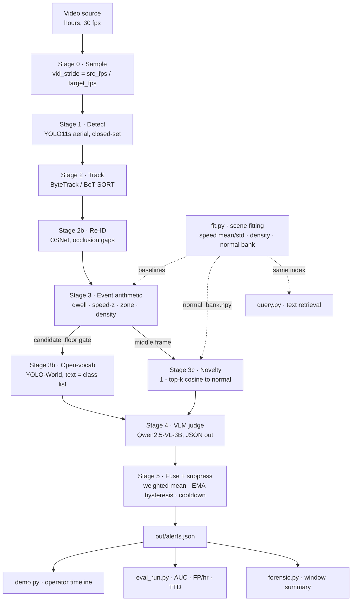
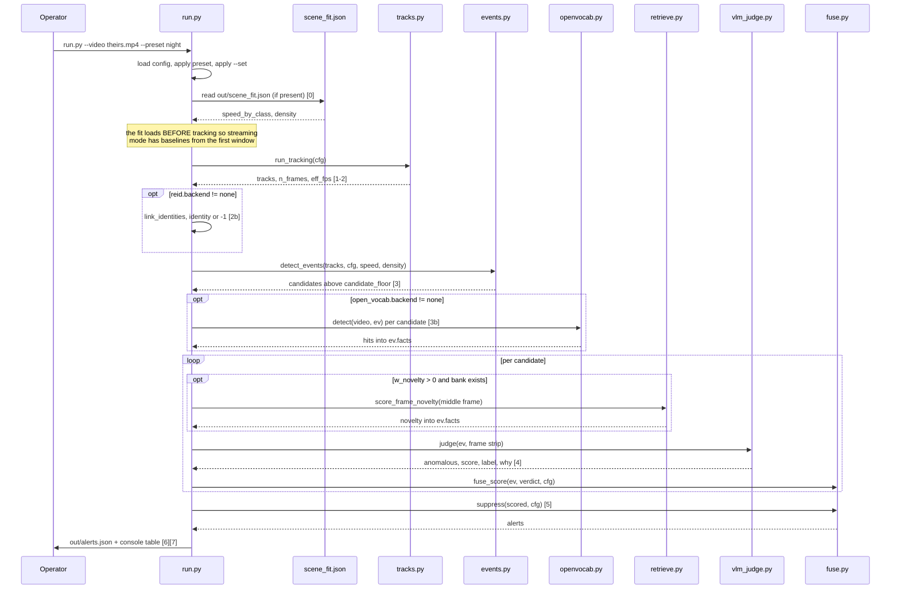
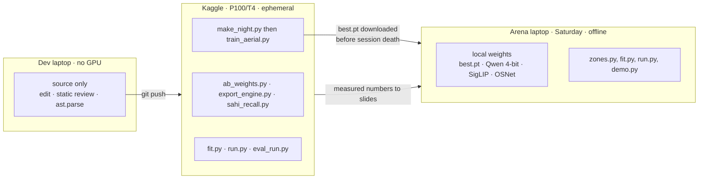
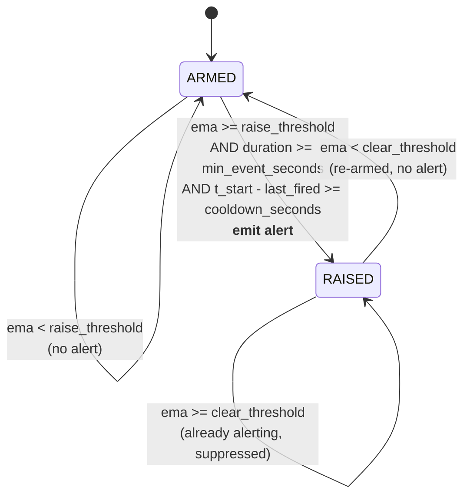

# Aerial Anomaly Intelligence — System Design

**High-Level Design (HLD) + Low-Level Design (LLD)**
Small-VLM anomaly detection on long-form drone and CCTV video.

| | |
|---|---|
| **Document** | `docs/DESIGN.md` — design of record |
| **Version** | 1.0 |
| **Date** | 2026-09-04 |
| **Status** | Design approved for build · implementation code-complete except the fine-tune (§17) |
| **Target event** | FlytBase Visual Intelligence Hackathon — 5 Sept 2026, FlytBase HQ, Pune |
| **Brief answered** | *"Can a small VLM detect anomalies in live drone video, in real time?"* |
| **System** | AAI — Aerial Anomaly Intelligence |
| **Repository** | `flytbase-prep` — 2,224 LOC across 24 Python modules |

### How to read this document

- **§1–§3** state the problem and the requirements. If you read one part, read **§3**.
- **§4–§10** are the **HLD**: the components, why the shape is a cascade, and how each of the four
  quality goals — *fast, accurate, available, consistent* — is bought by a specific structural
  decision rather than by hope.
- **§11–§16** are the **LLD**: data contracts, module interfaces, algorithms with complexity,
  refusal semantics, observability, and a requirement→code→verification traceability matrix.
- **§17** is an honest as-built status, including seven open gaps.

### Claim-strength convention

| Tag | Meaning |
|---|---|
| `MEASURED` | Produced by a run, with the command that produced it recorded |
| `TARGET` | A budget the design is built to hit, not yet verified |
| `DERIVED` | Arithmetic from other numbers in this document, not an observation |

**At v1.0, no performance or accuracy NFR carries `MEASURED`.** Nothing in this repository has
been executed against real data; the fine-tune has never been launched. That is a statement about
project phase, and it is deliberately visible here rather than hidden behind plausible figures.
§15 defines how each target becomes a measurement.

---

# Part I — Context and Requirements

## 1. Context

### 1.1 The problem as posed

The arena supplies hours of real urban drone footage, including night flights, plus benchmark
datasets, and asks whether a *small* VLM can detect anomalies in *live* video in *real time*.
Three self-paced levels are implied by the published scope list:

| Level | What it asks for | Where this design answers it |
|---|---|---|
| **L1** | **Detect and score.** An anomaly score, a threshold, an evaluation number. Everyone clears this. | §4 cascade · §12.5 events · §12.8 fusion · §12.11 evaluation |
| **L2** | **Context and identity.** Tracking, dwell, zones, re-ID — anomalies that exist only across time. Where the field thins. | §12.4 tracking · §12.5 events · §12.9 re-ID |
| **L3** | **Retrieval and forensics.** Ask the footage a question in words; get the clip and the reasoning back. | §12.10 retrieval · §12.12 forensic summary |

Level definitions are **inferred, not quoted**. The first operational act at the event is to read
the real definitions and re-plan if they differ (§19.3).

### 1.2 The physical constraint that dictates the architecture

A 3B-parameter VLM costs roughly **1–3 s per frame** on a single mid-range GPU. Ten minutes of
30 fps video is **18,000 frames**.

```
18,000 frames × 2 s/frame ≈ 10 GPU-hours   to watch 10 minutes of video
```

`DERIVED`. This is not a tuning problem, it is three orders of magnitude. **A one-model answer to
the brief is "no."** So the answer is not a model, it is a *shape*: a cheap always-on cascade that
reduces 18,000 frames to a handful of candidate windows and spends the VLM only there — where its
actual strength is the thing being asked for, namely judging whether a flagged thing is genuinely
unusual and saying why in words.

**The cascade sentence — the single claim this system exists to support:**

> *A small VLM cannot watch every frame, so it is the judge at the end of a cheap cascade —
> eight calls instead of eighteen thousand.*

The corollary is that **two models is the floor, because the brief's question has a floor.** A
cheap gate in front of the VLM is not architectural decoration; it *is* the finding.

### 1.3 The governing decision: train, fit, or prompt

The footage arrives at the event. Anything trained beforehand on another city's data learns a
different city, altitude, camera and lighting — and **"normal" is precisely what will not
transfer.** What *does* transfer is viewpoint and scale. Every capability is therefore sorted into
exactly one of three buckets, and that sort *is* the architecture:

| Bucket | Mechanism | Cost | What goes here | When |
|---|---|---|---|---|
| **Train** | Gradient descent | ~9 h GPU, offline | Aerial small-object detection (VisDrone + 40% synthetic night twins) — domain-general, survives the change of city | Before arrival |
| **Fit** | Arithmetic — mean, std, percentile, cosine | **< 5 min**, on their video | Per-class speed baseline · density baseline · normal-bank embeddings · zone polygons · thresholds | At the event, on unseen footage |
| **Prompt** | Text | Seconds | Open-vocabulary class list · VLM judge prompt and its JSON schema | Live, while being watched |

Two hard rules follow:

- **DR-1 — Never fine-tune the VLM.** No labels, no measurable gain, and it competes for the same
  GPU as the detector run. LoRA/PEFT is the most tempting wrong move available here. **The brief
  asks an architectural question, not a leaderboard one.** Prompt the judge; do not retrain it.
- **DR-2 — Never train an anomaly model on another city's normality.** Scene-specific baselines
  are *fitted*, and fitting is arithmetic, not gradient descent.

### 1.4 What "production grade" means here

This is a 22-hour build that must survive a public demo on borrowed wifi in front of people who
will ask what happens when a knob moves. "Production grade" is therefore defined operationally:

| Property | Operational definition used throughout this document |
|---|---|
| **Fast** | Sustained end-to-end throughput ≥ the source rate at the configured sampling; **latency-to-first-alert** bounded and measured, because a system that alerts only after the file ends is not real-time whatever its throughput |
| **Accurate** | Day and night reported *separately*; FP/hour and time-to-detection reported beside AUC; no metric printed that the label set cannot support |
| **Available** | Every optional model has a `none` backend; the pipeline completes with zero optional models, with the network off, and after any single stage fails |
| **Consistent** | One config surface, one override code path, deterministic decoding, explicit units at every boundary, and one alert per event rather than forty |
| **Auditable** | Every alert carries the measured numbers that justified it, so the VLM's sentence can be checked against arithmetic |

## 2. Design principles

These are the invariants. Where a later section makes a choice, it makes it because of one of
these, and says which.

| # | Principle | Consequence in the code |
|---|---|---|
| **P1** | **Cheap gates before expensive judges.** Each stage must be strictly cheaper per frame than the stage after it. | §4.4 reduction ladder; `events.candidate_floor` is the last gate before the VLM |
| **P2** | **Measure, don't assume.** Scene-specific "normal" is measured on the scene, never hardcoded. | `fit.py` → `out/scene_fit.json` → `events.detect_events` |
| **P3** | **Refuse rather than fabricate.** A missing score is `None`, never `0.0`. A refusal is a design output. | §11.4 — 17 enumerated refusal sites |
| **P4** | **Every stage reads a file and emits a file.** Any stage can be run, inspected and debugged alone. That property is what makes a bad hour survivable. | §4.3; `scene_fit.json`, `normal_bank.npy`, `alerts.json` |
| **P5** | **Text is the tuning surface.** What counts as an anomaly must change without training. | `open_vocab.prompts`, `vlm_judge.PROMPT` |
| **P6** | **One knob, one place.** Every parameter in `config.yaml`; presets and CLI overrides share one code path. | §6 — `PRESETS` are `--set` strings, not a parallel mechanism |
| **P7** | **Explain with numbers, not adjectives.** Each alert carries the arithmetic that produced it. | `CandidateEvent.facts` reaches the VLM prompt *and* the operator UI |
| **P8** | **Name the limitation.** A stated degradation beats an average that hides it. | Day/night split; §12.5 altitude caveat; §17.2 gap table; §18 risks |

## 3. Requirements

### 3.1 Functional requirements

Priority: **M** = must (the demo fails without it) · **S** = should · **C** = could (drop first).

| ID | Requirement | Pri | Acceptance criterion | Design ref |
|---|---|---|---|---|
| **FR-01** | Ingest long-form video (hours, not clips) from file or stream and temporally subsample to a configured target rate. | M | A 2-hour file processes without unbounded memory growth; `video.target_fps` changes cost proportionally. | §12.4, §12.16 |
| **FR-02** | Detect a restricted, configurable class set per sampled frame and associate detections into tracklets with stable IDs. | M | `[1-2]` reports *N* tracklets over *M* sampled frames at an effective fps. | §12.4 |
| **FR-03** | Fit scene-specific baselines on unseen footage in under 5 minutes **without training**: per-class speed statistics, object-density statistics, and a normal-frame embedding bank. | M | `fit.py --video theirs.mp4` writes `scene_fit.json` + `normal_bank.npy` and prints its wall time. | §12.3 |
| **FR-04** | Emit candidate events by arithmetic over tracklets against fitted baselines: **loiter**, **abandoned**, **speed_anomaly**, **zone_intrusion**, **density_anomaly**. | M | Each kind appears in `alerts.json` on a clip containing it, carrying the numbers that justified it. | §12.5, §13.1–13.4 |
| **FR-05** | Detect objects the closed-set detector has no class for, on candidate windows only, using a text prompt list as the class list. | S | Changing `open_vocab.prompts` changes hits with no retraining. | §12.6 |
| **FR-06** | Produce a zero-shot novelty score for a frame as its distance from the fitted normal bank. | S | `novelty` appears in alert facts and can be given fusion weight. | §12.10, §13.6 |
| **FR-07** | Adjudicate each candidate with a small VLM over a short frame strip, returning strictly parsed JSON `{anomalous, score, label, why}`. | M | Unparseable replies yield `score: None`, never a fabricated number. | §12.7 |
| **FR-08** | Fuse geometric, VLM and novelty scores, then suppress duplicates by hysteresis and per-track cooldown. | M | One loiterer produces one alert; counts before/after suppression reported. | §12.8, §13.5 |
| **FR-09** | Re-identify tracklets that are the same physical object across an occlusion gap. | S | One identity matched across a gap; both failure directions of the cosine threshold stateable. | §12.9, §13.7 |
| **FR-10** | Answer a natural-language query over the footage with ranked timestamps. | S | `python query.py "person carrying a bag near the gate"` returns the right clip. | §12.10 |
| **FR-11** | Produce a forensic paragraph over all alerts in a window, citing timestamps, without inventing detail. | C | Every claim checkable against the facts passed in. | §12.12 |
| **FR-12** | Evaluate against frame-level labels: ROC-AUC, P/R/F1 at a stated threshold, FP-frames, FP/hour, p50/p95 latency, time-to-detection, threshold sweep — **day and night separately**. | M | Two conditions, two tables, both reported even when night is worse. | §12.11, §15.3 |
| **FR-13** | Present an operator surface: alert timeline, click-to-play evidence clip, the one-sentence "why", and the measured facts beside it. | M | Someone who has not seen it can say what the system found and why within 30 s. | §12.13 |
| **FR-14** | Expose named operating presets (`day`, `night`, `fast`, `accurate`, `live`, `visdrone`) as one-line commands. | M | Each runs from a cold shell with one line, no YAML editing. | §6 |
| **FR-15** | Handle night footage on purpose: contrast recovery before inference **and** a separate, lower detection confidence. | M | Detection counts recorded four ways: day/night × before/after the night path. | §12.4, §13.8 |
| **FR-16** | Every emitted alert carries the measured facts that justified it. | M | `facts` non-empty for every alert and rendered in the UI. | §11.2 |
| **FR-17** | Explicit refusal semantics: insufficient data yields *no claim*, not a zero. | M | The §11.4 table holds at every listed call site. | §11.4 |
| **FR-18** | Operate fully offline at run time — no network fetch during a run. | M | A full run with the network disabled completes. | §7.3 |
| **FR-19** | **Emit alerts during the pass, not after it.** Latency-to-alert is the "real time" question. | M | `--preset live` prints alerts as found and reports the wall time of the first one. | §12.16 |
| **FR-20** | Bound memory over hours of footage. | M | Tracklets idle beyond `stream.retire_after` are dropped; live tracklet count reported at end. | §12.16 |
| **FR-21** | Define restricted zones without hand-typing pixel coordinates. | S | `zones.py` writes clicked polygons straight into `config.yaml`. | §12.14 |

### 3.2 Non-functional requirements

Grouped by the four quality goals. §15 defines the measurement for each.

#### 3.2.1 Fast — latency and throughput

| ID | Requirement | Target | How measured | Status |
|---|---|---|---|---|
| **NFR-F1** | End-to-end sustained throughput, whole pipeline, single T4/P100 | ≥ 1× realtime at `target_fps=3` (≥ 3 sampled fps ⇒ 30 fps source consumed in real time) | `run.py` `[7]` line | `TARGET` |
| **NFR-F2** | Per-event adjudication latency (frame extraction + VLM + fusion) | p50 ≤ 3 s, p95 ≤ 8 s | `alerts.json.vlm_latency_ms` → `evaluate.report` | `TARGET` |
| **NFR-F3** | **Latency to first alert** in streaming mode | ≤ `stream.window_seconds` + adjudication latency, and **strictly less than total run wall time** | `run.py` `[5b]` line | `TARGET` |
| **NFR-F4** | Cold-start scene adaptation on unseen footage | ≤ 300 s wall for 120 s of fit footage | `scene_fit.json.wall_seconds` | `TARGET` |
| **NFR-F5** | VLM invocation rate as a fraction of sampled frames | ≤ 1.0% (design point ≈ 0.44%) | `len(vlm_latency_ms) / n_frames` | `TARGET` |
| **NFR-F6** | Detector-only sustained throughput, TensorRT FP16 @ imgsz 1280 | ≥ 60 fps | `scripts/export_engine.py` bench line | `TARGET` |
| **NFR-F7** | Memory must be bounded, not proportional to footage length | Live tracklet count stabilises; retirement observed in the `[5]` line | Long-clip streaming run | `TARGET` |
| **NFR-F8** | Tracklet post-processing must not be superlinear in track length | `dwell_seconds` is O(n) per tracklet | §13.1 complexity argument + timing on a 10 k-point track | `TARGET` |
| **NFR-F9** | The VLM must never be re-paid for an event already judged | `(track_id, kind)` memoised across windows | `[5]` line: events judged ≤ candidates seen | Implemented |

**Latency budget** (`DERIVED`, 10 min of 30 fps source at `target_fps=3`):

| Stage | Work | Share of wall |
|---|---|---|
| Sample + detect + track | 1,800 frames × detector | ~60% |
| Event arithmetic | ~40 tracklets, pure numpy | < 1% |
| Open-vocab | 8 windows × 3 frames = 24 detector calls | ~3% |
| Novelty | 8 frames × SigLIP | ~2% |
| VLM judge | 8 calls × 6 frames | ~30% |
| Fuse + suppress + write | negligible | < 1% |

The distribution is the point: **the VLM is ~30% of the cost while doing 100% of the reasoning.**
Invert the cascade and it becomes 99.9%.

#### 3.2.2 Accurate — detection quality

| ID | Requirement | Target | How measured | Status |
|---|---|---|---|---|
| **NFR-A1** | Frame-level ROC-AUC, day | ≥ 0.80 on CUHK Avenue | `eval_run.py --tag day` | `TARGET` |
| **NFR-A2** | Frame-level ROC-AUC, night | ≥ 0.85 × day AUC — a bound on *degradation*, reported separately, **never averaged with day** | `eval_run.py --tag night` | `TARGET` |
| **NFR-A3** | False positives at the operating threshold | ≤ 10 FP/hour | `evaluate.report.fp_per_hour` | `TARGET` |
| **NFR-A4** | Time-to-detection from anomaly onset | p50 ≤ 5 s; a miss reported as a miss, never as 0 s | `eval_run.time_to_detection` | `TARGET` |
| **NFR-A5** | Detector quality vs stock weights | Fine-tune retained only if it wins on measured mAP50-95, day *and* night; otherwise stock is kept and the loss is reported | `scripts/ab_weights.py` verdict lines | `TARGET` |
| **NFR-A6** | Small-object recall on aerial footage | Tiling recall delta quantified before being claimed | `scripts/sahi_recall.py` | `TARGET` |
| **NFR-A7** | No metric may be emitted that the labels cannot support | Single-class label sets produce a refusal, not an AUC | `evaluate.report` / `sweep` | Implemented |
| **NFR-A8** | No fabricated sub-score may enter fusion | A `None` sub-score is dropped from the weighted mean and the mode is labelled `geometric_only` | `fuse.fuse_score` | Implemented |
| **NFR-A9** | Evaluation splits must not leak | Split by video, never by frame; `x.jpg` and `x_night.jpg` on the same side | Split manifest review | `TARGET` |
| **NFR-A10** | Night mAP must be reported on a night-only split, not inferred | A dedicated night val YAML exists | `scripts/make_night_yaml.py` | Implemented |

#### 3.2.3 Available — keeps working, degrades knowingly

| ID | Requirement | Target | How measured | Status |
|---|---|---|---|---|
| **NFR-V1** | Every model-bearing stage has a no-op backend | `vlm.backend=none`, `open_vocab.backend=none`, `reid.backend=none` all complete a run | `--preset fast` | Implemented |
| **NFR-V2** | Zero-optional-model operation | Full run completes on CPU with no VLM, no open-vocab, no re-ID, no bank | `python run.py --preset fast` | `TARGET` |
| **NFR-V3** | Offline operation | A complete run with the network disabled | Final dry run, wifi off | `TARGET` |
| **NFR-V4** | Single-stage failure containment | An exception in the open-vocab, novelty or VLM stage degrades that event to `geometric_only`; the run completes | Fault injection (§15.1) | **Gap G-A** |
| **NFR-V5** | Stage isolation / restartability | Each stage reads a file and emits a file; any consumer rerunnable alone off a saved artifact | Rerun `demo.py`, `eval_run.py`, `forensic.py`, `query.py` off one `alerts.json` | Implemented |
| **NFR-V6** | Session-loss survival (training) | An interrupted fine-tune leaves a usable checkpoint; `--resume` restarts it | `save_period=5`, `last.pt`, `--resume` | Implemented |
| **NFR-V7** | Graceful hardware fallback | `half=True` auto-disabled without CUDA; 4-bit skipped without CUDA rather than crashing deeper in | `_resolve_half`, `_quant_config` | Implemented |
| **NFR-V8** | Cold-start with no fit artifact | Missing `scene_fit.json` falls back to per-video statistics **and says so** | `run.py` `[0]` line | Implemented |
| **NFR-V9** | No in-memory-only results | Everything persisted to `alerts.json` at run end | File inspection | Implemented |

#### 3.2.4 Consistent — same input, same answer; stable alerts

| ID | Requirement | Target | How measured | Status |
|---|---|---|---|---|
| **NFR-C1** | Decode determinism | `vlm.temperature=0` ⇒ `do_sample=False`; models in `.eval()`; two runs on identical input+config give identical verdicts | Repeat-run diff of `alerts.json` excluding timing fields | Implemented |
| **NFR-C2** | Single configuration surface | Every knob in `config.yaml`; presets are `--set` strings through `apply_overrides`, so a preset cannot drift from an override | Code inspection: one code path | Implemented |
| **NFR-C3** | Override precedence total and stated | `config.yaml` < `--preset` < `--set`, applied in that order | §6 | Implemented |
| **NFR-C4** | Unit discipline at every boundary | Sampled-time seconds, source-frame numbers and pixels never mixed; `src_fps` recorded in `scene_fit.json` and read back by retrieval | §11.5 | Implemented |
| **NFR-C5** | Alert stability | One physical event ⇒ one alert, via EMA + raise/clear hysteresis + per-track cooldown | Alert count before/after suppression | Implemented |
| **NFR-C6** | Encoder consistency between index build and query | Query embeddings encoded with exactly the encoder tag recorded in the bank metadata | `retrieve._load_encoder(bank["encoder"])` | Implemented |
| **NFR-C7** | Colour-space consistency | BGR→RGB applied exactly once per path, in `fit.py`, `vlm_judge.py` and `reid.py` | §11.5, §15.2 | Implemented |
| **NFR-C8** | Reproducible synthetic data and training | Night synthesis seeded; training seeded; labels copied verbatim because geometry is unchanged | `make_night.py --seed`, `train_aerial.py --seed` | Implemented |
| **NFR-C9** | Config provenance in every output | The full effective config embedded in `alerts.json`, so any result reproduces from its own artifact | `alerts.json.config` | Implemented |
| **NFR-C10** | Batch and streaming modes must agree | The two paths must apply the same event arithmetic, fusion and hysteresis semantics | Same-clip batch vs live alert-set comparison | **Gap G-B** |

### 3.3 Explicitly out of scope

| Item | Why |
|---|---|
| VLM fine-tuning / LoRA / PEFT | DR-1. No labels, no measurable gain, GPU contention. |
| Training an anomaly model on Avenue/UCF-Crime normality | DR-2. Normality does not transfer between cities. |
| Multi-camera fusion / cross-camera re-ID | Single-feed scope for the arena; §10 states the extension path. |
| Geo-registration / map grounding | Optional upgrade F7, one-of-three, drop-first. |
| Owner-association for abandoned objects | Not implemented; the event means "object stopped moving", and the demo says so (§12.5). |
| Pixel→metric calibration (px/s → m/s) | Requires altitude telemetry; §18 R-04 names the limitation instead of pretending. |
| Audio, thermal or radar modalities | Not supplied by the brief. |

### 3.4 Constraints and assumptions

| # | Constraint | Impact on design |
|---|---|---|
| **CN-1** | No local GPU. All heavy execution on Kaggle (P100/T4), launched manually. | Local work is source-only; **static review of the diff is the check**, because a local run proves nothing. |
| **CN-2** | Kaggle sessions are ephemeral; GPU quota is weekly. | Anything to keep is written to `/kaggle/working/` and downloaded; runs are extrapolated before launch. §19.2 |
| **CN-3** | Venue wifi shared by ~70 people. | Every weight local before arrival; the offline run (NFR-V3) is a gate, not a nicety. |
| **CN-4** | ~22 working hours plus one unattended overnight GPU window. | The overnight fine-tune is the only schedule item that cannot slip. |
| **CN-5** | The event's own footage is unseen until the day. | All scene-specific parameters must be *fitted*, not trained (§1.3). |
| **AS-1** | Frame-level ground truth must be brought, not assumed supplied. | CUHK Avenue gates the metrics; `eval_run.py` takes a hand-built ranges file. |
| **AS-2** | The camera may be moving; altitude may change. | Pixel speed conflates object and platform motion — gated and named, not silently trusted. §18 R-04 |

---

# Part II — High-Level Design

## 4. Architecture

### 4.1 The shape: a reduction cascade with a reasoning tail



Three properties of this diagram carry the whole design:

1. **The gate before Stage 4.** `events.candidate_floor` is the last cheap decision before the
   expensive one. Everything to its left is arithmetic or a small closed-set detector; everything
   to its right runs on ~8 windows.
2. **`fit.py` is off the hot path and feeds three consumers.** One index — the SigLIP normal bank —
   serves *both* the zero-shot anomaly score (§13.6) and text retrieval (§12.10). One pass, two
   features, no extra model.
3. **Nothing on the hot path is trained on the scene.** The only trained artifact is the aerial
   detector, and it is domain-general by construction (§1.3).

### 4.2 Two execution modes over one cascade

The same stages run in two orders, selected by `stream.enabled` (`--preset live`).

| | **Batch** (default) | **Streaming** (`--preset live`) |
|---|---|---|
| Order | Track the *whole* file → events → judge → fuse → write | Per sampled frame: accumulate; every `window_seconds`: events → judge new → fuse → **emit** |
| First alert | Only after the file ends | Within one window + adjudication latency |
| Memory | `tracks` grows with footage length | Bounded by `retire_after` retirement |
| Re-ID, open-vocab | Available | Not wired into the window loop (§17.2 G-C) |
| Use | Evaluation, A/B, reproducible metrics | The "in real time" claim; long-form footage |

**Why both exist rather than only streaming.** Batch is the mode in which metrics are reproducible
and comparable — every candidate is scored against the complete tracklet set. Streaming is the
mode that answers the brief's *real-time* clause, and it prints
`[5b] first alert at Xs wall - batch mode could not have alerted before Ys`, which turns the
architectural claim into a measured number. On the brief's own footage — *"long-form CCTV and
drone video, hours not clips"* — a batch-only system means **zero alerts until the video ends**,
and that is a design defect, not a configuration choice.

### 4.3 Module inventory — reads, emits, consumed by

Principle **P4**: every stage reads a file and emits a file.

| Module | Reads | Emits | Consumed by | LOC |
|---|---|---|---|---|
| `fit.py` | their video, `config.yaml` | `out/scene_fit.json`, `out/normal_bank.npy` | events, fusion, retrieval | 153 |
| `pipeline/tracks.py` | video, detector weights | `{track_id: Tracklet}`, frame count, effective fps | events, re-ID, stream | 196 |
| `pipeline/events.py` | tracklets + fitted baselines | `CandidateEvent` with the facts that justified it | open-vocab, judge, stream | 166 |
| `pipeline/openvocab.py` | candidate windows, prompt list | boxes for classes COCO lacks | judge (via `facts`) | 63 |
| `pipeline/retrieve.py` | `normal_bank.npy`, text query or frame | ranked frames / novelty score | fusion, `query.py` | 107 |
| `pipeline/reid.py` | tracklet crops | appearance embeddings + identity links | events, UI | 127 |
| `pipeline/vlm_judge.py` | candidate + frame strip | `{anomalous, score, label, why}` | fusion | 200 |
| `pipeline/fuse.py` | geometric + VLM + novelty scores | alerts, after hysteresis and cooldown | UI, evaluation | 74 |
| `pipeline/stream.py` | live tracklets, judge | alerts **during** the pass | operator console, `alerts.json` | 145 |
| `pipeline/evaluate.py` | alerts + labels | AUC, P/R/F1, FP/hour, latency percentiles | slides | 49 |
| `run.py` | everything above | `out/alerts.json` + a console table | the operator, at 09:20 Saturday | 219 |
| `demo.py` | `alerts.json` | static self-contained `out/demo.html` | judges | 79 |
| `eval_run.py` | `alerts.json` + label ranges | metrics tables, sweep, time-to-detection | slides | 72 |
| `query.py` | text query + bank | ranked timestamps | L3 demo | 32 |
| `forensic.py` | `alerts.json` | one paragraph citing timestamps | L3 demo | 41 |
| `zones.py` | a still frame + clicks | `events.restricted_zones` written into `config.yaml` | events | 95 |
| `train/make_night.py` | daylight training set | `*_night.*` images + copied labels | fine-tune | 62 |
| `train/train_aerial.py` | VisDrone (+ night twins) | `weights/<name>/weights/best.pt` | detector | 75 |
| `scripts/ab_weights.py` | tuned + stock weights | mAP table + verdict | NFR-A5 | 51 |
| `scripts/make_night_yaml.py` | night image dir | night-only val YAML | NFR-A10 | 54 |
| `scripts/export_engine.py` | weights | TensorRT engine + sustained fps | NFR-F6 | 55 |
| `scripts/sahi_recall.py` | weights, video | recall delta from tiling | NFR-A6 | 81 |

### 4.4 The reduction ladder — where the cost goes

`DERIVED` for 10 minutes of 30 fps footage at `target_fps=3`:

| Stage | Mechanism | In | Out | Reduction |
|---|---|---|---|---|
| Source | — | 18,000 frames | — | — |
| Frame sampling | `vid_stride = 10` | 18,000 | 1,800 frames | **10x** |
| Detect + track | YOLO11s aerial + ByteTrack, always on | 1,800 frames | ~40 tracklets | **45x** |
| Event arithmetic | dwell · speed-z · zone · density vs fitted baselines | ~40 tracklets | ~8 candidates | **5x** |
| Open-vocab | YOLO-World on candidate windows only | 8 windows | 24 frames | — |
| VLM judge | Qwen2.5-VL-3B, 6-frame strip, JSON out | 8 candidates | 8 calls | — |
| Fuse + suppress | hysteresis + cooldown | 8 verdicts | ~3 alerts | **2.7x** |

**8 VLM calls instead of 18,000 — roughly 2,000x fewer**, sampling 48 images, or **0.27% of the
footage.** A parallel SigLIP pass over the same frames is simultaneously the normal-bank anomaly
score and the retrieval index.

### 4.5 Model inventory — sorted by what it actually costs

Two models do the work. Three more are level-gated add-ons. Four rows commonly listed as
"components" are not models at all.

**Core — these two answer the brief on their own (~2.6 GB on disk):**

| Model | Size | Does what nothing else can | Fallback |
|---|---|---|---|
| **YOLO-World-L** | ~90 MB | Detection *and* open-vocabulary: text is the class list. Nothing else can name a thing it was never trained on — which is what "anomaly" means. | Grounding DINO Swin-T (not implemented) |
| **Qwen2.5-VL-3B-Instruct** (4-bit) | ~2.5 GB | The judgement, and the sentence explaining it. Literally the "small VLM" of the problem statement. | SmolVLM2-2.2B (implemented) |

**Level-gated — added when its level arrives:**

| Model | Size | What it buys | Added at |
|---|---|---|---|
| VisDrone-pretrained YOLO + our night fine-tune | ~19 MB | A fast closed-set pass so YOLO-World only fires on candidates. A *speed* optimisation, not a capability — it is what makes the FPS number real. | F3 |
| SigLIP ViT-B-16 (webli) | ~800 MB | One index serving the normal-bank anomaly score *and* text retrieval — dual use | F2 |
| OSNet-x1.0 (torchreid) | ~9 MB | Re-ID across occlusion gaps. **Only if needed** — check BoT-SORT's own re-ID first. | F1 |
| SAM 2.1 hiera-small | ~180 MB | Masks that propagate through video themselves. Strictly optional. | F7 |

**Not models — no weights, no download, no disk:**

| Row | What it actually is |
|---|---|
| SAHI tiling (640 @ 0.2) | A slicing technique wrapping the detector already loaded. **A 15 px top-down person survives tiling and dies in a 640 resize.** |
| BoT-SORT / ByteTrack | Tracking algorithms — Kalman filter plus Hungarian matching over boxes. Config, not weights. |
| CLAHE + separate night `conf` | An OpenCV histogram function, about five lines. Recovers contrast *before* inference instead of hoping the detector generalises. |
| TensorRT export | A compiler that re-exports the detector already held. One line. |

**On chasing versions.** `pip install -U ultralytics` and use the newest checkpoint — the API is
identical, so it is a one-string change. But do not spend time there: a version bump buys a couple
of mAP points, while `imgsz=1280` plus tiling buys far more on aerial footage. **YOLO-World rides
a YOLOv8 backbone regardless, so a newer YOLO is not a newer open-vocabulary model.**

### 4.6 Sequence of a batch run



## 5. Deployment view

Three environments with a deliberate division of labour. **Nothing heavy runs where the code is
written.**



| Environment | Role | Hard rules |
|---|---|---|
| **Dev laptop** | Source of truth for code. No GPU, no dataset. | Never `pip install`, train or infer here. A local run proves nothing, so **static review of the diff is the check**. |
| **Kaggle notebook** | The runtime. Training, A/B, export, evaluation. | Re-clone every session — uncommitted local edits do not exist there. **Commit and push before starting a session.** Everything to keep goes to `/kaggle/working/` and is downloaded before the session dies. |
| **Arena laptop** | The demo. | Every weight local before arrival (CN-3). The final rehearsal runs with the network disabled. |

**Target production topology (beyond the arena).** The same cascade maps onto an edge deployment
without restructuring: the always-on left half (sample → detect → track → event arithmetic) runs
on a Jetson-class device beside the camera at TensorRT FP16, and only candidate windows — already
~0.27% of the footage — cross the network to a GPU host running the VLM judge. The bandwidth
argument is identical to the compute argument, and the cascade supplies both.

## 6. Control plane — configuration and operability

**P6: one knob, one place.** `config.yaml` is the single source of every parameter, and there are
exactly three layers applied in a fixed order:

```
config.yaml   (defaults; every knob marked KNOB)
    overridden by
--preset  day | night | fast | accurate | live | visdrone   (as --set strings)
    overridden by
--set detector.imgsz=1280 vlm.backend=qwen         (dotted keys, yaml-parsed values)
```

Presets are deliberately **not** a parallel mechanism — they are lists of `k=v` strings pushed
through the same `apply_overrides()` walk as `--set`, so a preset can never drift from what an
override does (NFR-C2). `--set` is applied last, so an explicit override always wins.

| Preset | Overrides | Intent |
|---|---|---|
| `day` | `detector.conf=0.25`, `night.enabled=false`, `vlm.backend=qwen` | Baseline daylight operation |
| `night` | `detector.conf=0.20`, `night.enabled=true`, `night.conf=0.15`, `night.clahe=true`, `vlm.backend=qwen` | Contrast recovery + a lower confidence floor |
| `fast` | `video.target_fps=2`, `detector.imgsz=960`, `vlm.backend=none`, `open_vocab.backend=none` | Geometry-only triage; CPU-viable; **the availability floor** |
| `accurate` | `video.target_fps=5`, `detector.imgsz=1280`, `vlm.backend=qwen`, `open_vocab.backend=yoloworld`, `vlm.frames_per_event=8` | Maximum quality, cost accepted |
| `live` | `stream.enabled=true`, `detector.conf=0.25`, `vlm.backend=qwen` | **Alerts during the pass** — the answer to "in real time" |
| `visdrone` | `detector.weights=weights/aerial_night/weights/best.pt`, `detector.classes=[0..9]`, `events.person_classes=[0,1]` | Switch to the fine-tuned checkpoint **and its class semantics together** — see the class-map hazard in §12.5 |

The operability requirement behind this (FR-14) is blunt: **Saturday morning types commands, it
does not edit code.** `zones.py` exists for the same reason — the runbook allots three minutes to
drawing zone polygons, and hand-typing pixel coordinates under time pressure is exactly the kind
of thing that eats twenty minutes on the day.

## 7. Availability design

### 7.1 The degradation ladder

Availability here is not redundancy — there is one laptop. It is *graceful degradation with a
stated floor*. Each rung removes a capability and keeps the system answering.

| Rung | Condition | What still works | What is lost | Score mode |
|---|---|---|---|---|
| 0 | Everything present | Full cascade, novelty, re-ID, forensics, retrieval, streaming | — | `fused` |
| 1 | `fuse.w_novelty=0` or no `normal_bank.npy` | Geometry + open-vocab + VLM | Zero-shot novelty term | `fused` |
| 2 | `reid.backend=none` | Everything except identity linking | Cross-occlusion identity | `fused` |
| 3 | `open_vocab.backend=none` | Geometry + VLM | Naming unseen classes | `fused` |
| 4 | `vlm.backend=none` | Geometry, events, alerts, UI, evaluation | The judgement and the "why" sentence | **`geometric_only`** |
| 5 | No `scene_fit.json` | Per-video statistics computed on the fly, announced in `[0]` | Scene-fitted baselines; the 5-minute-adaptation claim; all density events | `geometric_only` |
| 6 | No CUDA | Full run on CPU: `half` auto-disabled, 4-bit skipped | Real-time throughput | `geometric_only` |

Rung 4 is the load-bearing one. `NoopJudge.judge()` returns
`anomalous: None, score: None, label: "not judged", why: "vlm.backend=none - geometric score
only"`, and `fuse_score` detects the single-part case and returns the geometric score labelled
`geometric_only` — **never a silently zeroed VLM term** (NFR-A8, P3).

### 7.2 Failure-mode and effects analysis

| # | Failure | Detection | Effect today | Mitigation | Status |
|---|---|---|---|---|---|
| FM-1 | VLM OOM on a large frame strip | CUDA OOM traceback | **Run aborts** | Per-event exception boundary to `geometric_only`; `max_pixels` and `frames_per_event` are the two levers | **Gap G-A** |
| FM-2 | VLM returns prose, not JSON | `_parse` finds no JSON object | `score: None`, `label: "unparsed"`, raw text truncated into `why` | Correct already — refusal, not a zero | Implemented |
| FM-3 | `bitsandbytes` absent or no CUDA | Import failure / `cuda.is_available()` false | Loads fp16 / CPU **with a printed reason** instead of crashing deeper in | `_quant_config` returns `None` and says why | Implemented |
| FM-4 | `half=True` on CPU | Raises in several Ultralytics versions | Decided once, up front | `_resolve_half` | Implemented |
| FM-5 | No `scene_fit.json` | `os.path.exists` | Falls back to per-video stats, prints the fallback | Implemented | Implemented |
| FM-6 | Density baseline unavailable (<20 samples) | `density is None` | **No density events at all** — no baseline, no claim | Deliberate refusal (P3) | Implemented |
| FM-7 | Fewer than 20 speed samples for a class | `_speed_stats` returns `(None, None)` | No speed event for that class | Deliberate refusal | Implemented |
| FM-8 | Tracklet shorter than `min_track_frames` | `tr.n() < 6` | Skipped entirely — a 2-frame blip gets no verdict | Deliberate refusal | Implemented |
| FM-9 | Corrupt/unseekable frame in a window | `cap.read()` returns False | That timestamp is skipped; the strip is shorter | Implemented | Implemented |
| FM-10 | Memory growth over hours | Live tracklet count climbing | Streaming retires idle tracklets; batch does not | `stream.retire_after`; use `--preset live` on long footage | Implemented (streaming) |
| FM-11 | Kaggle session dies mid-training | Wall-clock overrun | `save_period=5` plus `last.pt` plus `--resume` | Epoch-1 extrapolation prevents the overrun | Implemented |
| FM-12 | Weight download attempted at demo time | Network access on a wifi-off run | Fails visibly in rehearsal rather than on stage | NFR-V3 offline dry run | `TARGET` |
| FM-13 | Fine-tuned detector loses to stock | `ab_weights.py` verdict line | Stock kept, loss reported on the slide | NFR-A5 — **a legitimate result, not a wasted night** | Implemented |
| FM-14 | Re-ID merges two strangers | Identity count implausibly low | `cosine_threshold` too low; class and temporal-overlap gates already block the impossible cases | §13.7 | Implemented |
| FM-15 | Tracker ID churn under occlusion | Identity count implausibly high | `track_buffer` up; or BoT-SORT; or OSNet re-ID | §13.7 | Implemented |
| FM-16 | A re-appearing track id re-alerts instantly after retirement | Duplicate alerts for one object | Suppression state is **deliberately not cleared** when a tracklet retires | `stream._retire` | Implemented |

### 7.3 Offline guarantee

Three things reach for the network by default and must be pinned before the arena: Ultralytics
weight auto-download, HuggingFace model resolution, and `open_clip` pretrained tags. The
verification is not code review — it is **a full run with the network disabled**, the only way to
prove nothing silently fetches. It is a scheduled gate (§19.3), not an afterthought.

## 8. Consistency design

Consistency has two distinct meanings here and both are requirements.

### 8.1 Reproducibility — same input, same answer

| Mechanism | Where | Guards against |
|---|---|---|
| `temperature=0` giving `do_sample=False` | `_HFVisionJudge._generate` | A judge that changes its mind between runs is unusable |
| `model.eval()` on every loaded model | judge, `fit.py`, `retrieve._load_encoder` | BatchNorm/dropout drift moving embeddings between runs |
| Encoder tag round-trip | `scene_fit.json.normal_bank.encoder` into `_load_encoder` | Querying a SigLIP index with a CLIP text tower |
| Seeded synthesis and training | `make_night.py --seed`, `train_aerial.py --seed` | An unreproducible training set or run |
| Effective config embedded in output | `alerts.json.config` | A result that cannot be reproduced from its own artifact |
| Single override code path | `apply_overrides` for both preset and `--set` | Preset semantics drifting from CLI semantics |
| Union-find grouping in re-ID | `reid.link_identities` | Identity groups that depend on iteration order |

Residual nondeterminism is stated rather than denied: GPU floating-point reduction order and cuDNN
kernel selection can move a score in the last decimal place. Alert *decisions* are stable because
thresholds are not knife-edge and hysteresis absorbs single-sample noise.

### 8.2 Alert stability — one event, one alert

Without suppression, one loiterer standing in a doorway for four minutes generates an event per
overlapping window — dozens of rows for one fact. That destroys operator trust and inflates
FP/hour. Four mechanisms compose (§13.5):

1. **EMA per track** (`ema_alpha`) — a single noisy score cannot open an alert.
2. **Raise/clear hysteresis** (`raise_threshold` above `clear_threshold`) with a latched state — a
   track already raised does not re-alert until it has cleared low.
3. **Minimum duration** (`min_event_seconds`) — sub-second artefacts are not alerts.
4. **Per-track cooldown** (`cooldown_seconds`) — the hard backstop.

In streaming mode all four persist **across windows**, and `(track_id, kind)` memoisation means
the VLM is never re-paid for an event it has already judged (NFR-F9).

## 9. Performance design

The performance strategy is entirely structural. There is no micro-optimisation in it.

| Lever | Mechanism | Effect | Cost |
|---|---|---|---|
| **Temporal subsampling** | `vid_stride = src_fps / target_fps` | 10x at `target_fps=3` | Loses almost nothing for loitering; raise only for falls and collisions |
| **Cascade gating** | `candidate_floor` before the VLM | ~2,000x fewer VLM calls | Anything geometry misses never reaches the judge — recall responsibility sits in Stage 3 |
| **Event memoisation** | `(track_id, kind)` set in streaming | The VLM is never re-paid for a known event | Only the first occurrence of a kind per track is judged |
| **Quantisation** | Qwen 4-bit NF4, double-quant, bf16 compute | ~7 GB to ~2.5 GB | Small quality cost; makes detector and VLM co-resident |
| **`max_pixels`** | Vision-tower token budget | Halve it, roughly halve VLM latency | **The single biggest latency lever** |
| **`frames_per_event`** | Strip length | 4-8 is the band | Below 4 loses temporality; above 8 pays for nothing |
| **TensorRT FP16** | Detector re-export | Detector-side headroom | Export/verify step; the engine is tied to the GPU |
| **Capture reuse** | One `cv2.VideoCapture` for every frame read in the judging loop | Removes 2-3 open/seek/close cycles **per event** | — |
| **O(n) dwell** | Monotonic-deque two-pointer instead of O(n²) centroid recompute | Minutes to milliseconds on a 10 k-point track | §13.1 |
| **Encoder caching** | `retrieve._CACHE` keyed by encoder tag, on GPU | Removes a full SigLIP load **per event** | — |
| **Tracklet retirement** | `stream.retire_after` | Bounds memory over hours | Retired tracklets cannot gain new events |
| **Conditional stages** | Open-vocab loop and novelty import only when enabled | No no-op work | — |

Five of these (capture reuse, O(n) dwell, encoder caching, event memoisation, retirement) are
corrections to real quadratic, per-event-reload or unbounded-growth behaviour found by static
review. They are listed here because the throughput target depends on them.

## 10. Scaling beyond one feed

Not required by the arena; stated because it is the first question a deployment review asks.

| Dimension | Approach | Why it works with this shape |
|---|---|---|
| **N cameras** | Shard by camera. One process per feed, each with its own `scene_fit.json`. | Scene fitting is per-scene by definition; there is no shared trained state to synchronise. |
| **GPU sharing** | The always-on left half is per-camera; the VLM judge becomes a shared queued service. | Only ~0.27% of frames need it — one judge serves many cameras. |
| **Backpressure** | Bounded candidate queue, shed by `geo_score` descending. | The geometric score is already a priority signal. |
| **Long-horizon retrieval** | The normal bank generalises to a per-camera vector index; `search()` is a dot product. | The index is built once per fit and is dual-use. |
| **Cross-camera identity** | OSNet embeddings already exist per tracklet; extend the union-find to a cross-camera gallery. | The temporal-overlap gate becomes a travel-time gate. |
| **Model updates** | The detector is the only trained component; swap `detector.weights` and re-run `ab_weights.py`. | One trained artifact, one A/B gate. |

### Security and privacy posture

| Concern | Position |
|---|---|
| Data egress | None at run time (NFR-V3). All inference local; the design is on-prem by construction. |
| Personal data | Crops are held in memory for embedding and discarded. `alerts.json` stores geometry and timestamps, not imagery; `demo.html` references the source video by relative path rather than embedding frames. |
| Re-ID scope | Identity IDs are per-run integers. No gallery, no enrolment, no cross-session linkage. |
| Retention | Governed by whoever holds the source video; the system adds only small JSON artifacts. |
| Model provenance | Any community checkpoint used as a training base must have its licence and its claimed training set verified, and must pass the A/B gate like everything else — **a random community checkpoint can be worse than stock.** |

---

# Part III — Low-Level Design

## 11. Data contracts

### 11.1 `out/scene_fit.json` — the fitted scene

Written by `fit.py`. Read by `run.py` (baselines) and `retrieve.py` (bank metadata).

```jsonc
{
  "video": "data/theirs.mp4",           // string  - provenance
  "sampled_frames": 360,                // int     - frames actually processed
  "eff_fps": 3.0,                       // float   - src_fps / vid_stride
  "fit_seconds_requested": 120.0,       // float   - the --fit-seconds budget
  "fit_seconds_of_video": 120.0,        // float   - sampled_frames / eff_fps
  "speed_by_class": {                   // map class-id(string) -> stats | null
    "0": { "mean": 41.2, "std": 18.7 }, //   px/s in SAMPLED time
    "2": null                           //   null = refused, <20 samples (P3)
  },
  "speed_refused_classes": ["2"],       // list    - explicit, not inferred
  "density": {                          // objects per sampled frame, or null
    "mean": 6.4, "std": 2.1, "p95": 11.0
  },
  "normal_bank": {                      // null when open_clip is unavailable
    "encoder": "ViT-B-16-SigLIP/webli", //   MUST be reused verbatim at query time
    "n": 200,                           //   rows in normal_bank.npy
    "frame_idx": [0, 43, 91],           //   SOURCE frame numbers, not sampled
    "src_fps": 29.97,                   //   the video's own fps (NFR-C4)
    "sampled_from": "412 quiet frames"  //   provenance of the bank
  },
  "wall_seconds": 143.8                 // float   - the FR-03 deployability number
}
```

**Invariants.** `speed_by_class[c]` is `null` **or** carries both `mean` and `std` — never a
partial object. `density` is `null` under 20 samples. `normal_bank.frame_idx` is in **source**
frame numbers and `normal_bank.src_fps` is the **source** fps; converting with `eff_fps` instead
would overstate every retrieval timestamp by the stride factor.

### 11.2 `out/alerts.json` — the run artifact

Written by `run.py` (both modes, via `_write_out`). Read by `demo.py`, `eval_run.py`,
`forensic.py`. Self-describing on purpose: it embeds the effective config, so any result
reproduces from its own artifact (NFR-C9).

```jsonc
{
  "config": { /* the FULL effective config after preset and --set */ },
  "eff_fps": 3.0,
  "n_frames": 1800,
  "wall_seconds": 512.4,                // end-to-end, for the FPS claim
  "track_seconds": 301.2,               // batch mode only - bottleneck attribution
  "vlm_latency_ms": [2140.5, 1980.2],   // one per adjudicated candidate -> p50/p95
  "alerts": [
    {
      "kind": "loiter",                 // loiter | abandoned | speed_anomaly |
                                        //   zone_intrusion | density_anomaly
      "track_id": 17,                   // -1 for scene-level (density) events
      "cls": 0,                         // detector class id; -1 for scene-level
      "t_start": 132.0,                 // seconds, SAMPLED time
      "t_end": 136.0,
      "score": 0.781,                   // fused (or geometric_only) score
      "ema": 0.744,                     // smoothed score at the raise decision
      "geo_score": 0.62,                // pre-fusion geometric term, always present
      "facts": {                        // FR-16: the arithmetic that justified it
        "dwell_s": 18.4, "radius_px": 45,
        "track_window": [120.0, 158.0],
        "identity": 12,                 // only when re-ID actually linked it
        "owner_hint": { "possible_owner_track_id": 4, "distance_px": 62.0 },
                                        // abandoned only, and only when a person
                                        //   was actually nearby - a hint, not a claim
        "novelty": 0.412,               // only when the bank was consulted
        "open_vocab_hits": [ { "t": 133.0, "prompt": "abandoned bag",
                               "conf": 0.31, "xyxy": [0,0,0,0] } ]
      },
      "label": "person loitering at gate",  // VLM, or "not judged"
      "why": "A person remains ..."          // VLM sentence, or the noop reason
    }
  ]
}
```

**Invariants.** `facts` is non-empty for every alert (FR-16). `score` is a float in [0,1].
`label`/`why` may be the noop strings but are never absent. `t_start <= t_end`, and
`t_end - t_start >= fuse.min_event_seconds` for every emitted alert.

### 11.3 Ground-truth label file (input to `eval_run.py`)

Whatever the dataset ships (CUHK Avenue ships `.mat`) is converted once into:

```json
{ "anomalous_ranges": [[12.0, 18.5], [40.0, 44.0]] }
```

Seconds, for **this** video, in the same time base as `alerts.json`. Frame labels are painted from
these ranges at `eff_fps` (§12.11), so the range file and the alerts file must come from the same
run's `eff_fps`.

### 11.4 The refusal contract

**P3 as a table.** These are not missing features; they are the specified behaviour, and a
reviewer should be able to check each one.

| Call site | Condition | Returns | Rationale |
|---|---|---|---|
| `Tracklet.speeds_px_s` | fewer than 2 points | `None` (not `0.0`) | Speed is undefined, not zero |
| `Tracklet.speeds_px_s` | duplicate timestamps | `NaN` for that step | A zero dt is bad data, not infinite speed |
| `Tracklet.dwell_seconds` | fewer than 2 points | `0.0` | Dwell over a single sample genuinely is zero |
| `events._speed_stats` | fewer than 20 samples for a class | `(None, None)` | No baseline, no z-score, no claim |
| `events.detect_events` | `tr.n() < min_track_frames` | tracklet skipped | A 2-frame blip gets no verdict |
| `events.detect_events` | `sd` is `None` or `0.0` | no speed event | A zero-variance baseline cannot produce a z |
| `events._density_events` | `density` is `None` or `std` falsy | no events emitted | No fitted baseline, no crowding claim |
| `fit.py` density | fewer than 20 frame samples | `density: null` | Same rule, persisted |
| `fit.fit_embeddings` | `open_clip` missing or no frames read | `None` | No bank rather than an empty one |
| `vlm_judge._parse` | no JSON object in the reply | `score: None`, `label: "unparsed"` | An unparseable judge has no opinion |
| `vlm_judge._parse` | `score` key present but null | `score: None` | Preserved, never coerced |
| `fuse.fuse_score` | only the geometric part present | `(geo_score, "geometric_only")` | The mode is *labelled*, so a reader knows |
| `NoopJudge.summarize` | `vlm.backend=none` | `(None, reason)` | Refusal carries its reason |
| `retrieve.load_bank` | no bank in `scene_fit.json` | `(None, None, reason)` | Callers print `refused: <reason>` |
| `reid.tracklet_embedding` | fewer than `min_crops` usable crops | `None` | A single frame is not a re-ID signature |
| `reid.link_identities` | no usable embedding | keeps own `track_id`, excluded from `linked` | No claim beats a guessed one |
| `evaluate.report` | labels single-class | `{"error": ...}`, no AUC | AUC is undefined; printing one would be a lie |
| `evaluate.sweep` | labels single-class | one-row error list | Refuses as a whole rather than emitting threshold-only rows |
| `eval_run.time_to_detection` | a labelled range never caught | `None` | A miss, reported as a miss, never as 0 s |
| `openvocab.NoopOpenVocab` | backend `none` | `{hits: [], reason: "...not run"}` | Empty **with a reason**, distinguishable from "looked and found nothing" |

### 11.5 Unit and colour-space discipline (NFR-C4, NFR-C7)

Four conversions in this system are silent when wrong — nothing raises, quality just drops.

| Quantity | Space | Where converted | Failure if mixed |
|---|---|---|---|
| Tracklet `t[]` | seconds in **sampled** time (`i / eff_fps`) | `tracks._accumulate` | Every downstream window shifts |
| `normal_bank.frame_idx` | **source** frame numbers | `fit.py` quiet frames: `t * src_fps` | Retrieval timestamps overstated by the stride factor |
| Retrieval seconds | `frame_idx / src_fps` — never `eff_fps` | `retrieve.search` | 10x timestamp error at `target_fps=3` |
| Speeds, radii | **pixels** per second / pixels | `events.py` | Altitude-dependent; see §18 R-04 |
| Frame colour | OpenCV BGR to model RGB, exactly once | `fit.py` `f[:, :, ::-1]`; `vlm_judge`/`reid` `cv2.cvtColor` | **Nothing crashes** — detection quality quietly drops |
| Array layout | HWC (NumPy/PIL) to CHW (Torch), plus batch dim | inside the model processors | Shape error two frames deep in a stack trace |

## 12. Module specifications

Each specification states: responsibility, interface, algorithm, knobs, refusals, invariants.

### 12.1 `run.py` — orchestrator

**Responsibility.** Resolve configuration, dispatch to batch or streaming, emit one log line per
stage, persist `alerts.json`. It owns no algorithm; it owns the *order* and the artifact.

**Interface.**
```
run.py --config config.yaml [--video PATH]
       [--preset day|night|fast|accurate|live] [--set k.k=v ...]
       [--out out/alerts.json]

apply_overrides(cfg, pairs) -> dict
_write_out(path, cfg, eff_fps, n_frames, alerts, wall, lat, t_track=None) -> None
_run_streaming(cfg, a, t_all0, speed_stats, density, novelty_fn) -> None
```
`apply_overrides` walks dotted keys (`vlm.backend`) and parses the value with `yaml.safe_load`, so
`false`, `0.25` and `[1,2]` all arrive correctly typed.

**Ordering decision worth noting.** The scene fit is loaded **before** tracking, not after. In
batch mode the order would not matter; in streaming mode the baselines must be available from the
very first window, so the load was hoisted. One code path, both modes.

**The log line contract** — §14 treats these as a machine-parseable trace:

| Line | Stage | Emits |
|---|---|---|
| `[0]` | preset applied / scene fit loaded (or the fallback notice) | provenance |
| `[1-2]` | tracking (batch) | tracklet count, sampled frames, eff fps, wall, frames/s |
| `[1-5]` | streaming header | window and retire_after, notice that alerts appear as found |
| `[2b]` | re-ID (conditional) | tracklets to identities, count linked across gaps |
| `[3]` | candidate events | count and % of tracklets |
| `[3b]` | open-vocab (conditional) | total hits across candidate windows |
| `[4]` | VLM stage | call count and mean ms |
| `[5]` | suppression | alerts kept, events suppressed (batch) / alerts, events judged, live tracklets (streaming) |
| `[5b]` | streaming only | **first alert at Xs wall — batch could not have alerted before Ys** |
| `[6]` | write | output path |
| `[7]` | end-to-end | wall seconds and sustained FPS, "this machine" |

**Invariants.** Preset before `--set` (NFR-C3). Open-vocab is constructed only when enabled — an
earlier version looped every candidate through a no-op. One `cv2.VideoCapture` serves the whole
judging loop and is released in a `finally`. `vlm_latency_ms` is persisted because F5 needs
p50/p95 and it was previously measured, printed and thrown away.

**Known gap.** No exception boundary around the per-event stages (NFR-V4, §17.2 G-A).

### 12.2 `config.yaml` — the knob surface

Nine sections: `video`, `stream`, `detector` (incl. `sahi`), `events`, `open_vocab`, `night`,
`reid`, `retrieve`, `vlm`, `fuse`. Every line a reviewer is likely to ask about is marked `KNOB`.
The full knob reference with failure directions is §19.1 — that table exists because **the first
question a reviewer asks is never "what model?", it is "what happens if you turn this up?"**

Two defaults are themselves design statements: `detector.weights: yolo11s.pt` at
`imgsz: 1280` (the `s` size matches the overnight fine-tune, and 1280 is the aerial requirement),
and `open_vocab.weights: yolov8l-worldv2.pt` — **the brief's YOLO-World-L**, dropped to `s` only
if FPS forces it and *said out loud* rather than left as a silent mismatch with the slide.

### 12.3 `fit.py` — scene fitting (FR-03)

**Responsibility.** Measure the scene-specific parameters on footage never seen before. **Nothing
here trains.** This module is the deployability claim: *five minutes to adapt to a scene we had
never seen.*

**Interface.**
```
fit.py --video PATH [--config config.yaml] [--fit-seconds 120] [--bank-frames 200]

src_fps_of(video_path) -> float
fit_embeddings(video_path, n_frames, out_npy, max_seconds=None,
               quiet_frames=None) -> dict | None
```

**Algorithm.**
1. Track `--fit-seconds` of footage. This sets `cfg["video"]["max_seconds"]`, which caps the read —
   so the five-minute claim holds on a two-hour file instead of quietly processing all of it.
2. **Speed baseline** — `_speed_stats(tracks)` per class; `(None, None)` under 20 samples.
3. **Density baseline** — objects per sampled timestamp, to `mean`, `std`, `p95`; `None` under 20
   samples.
4. **Quiet-frame selection** — timestamps whose object count is **at or below the scene median**,
   converted from sampled seconds to source frame numbers via `src_fps_of`.
5. **Normal bank** — SigLIP ViT-B-16/webli (fallback ViT-B-32/openai) over those quiet frames,
   L2-normalised, saved to `out/normal_bank.npy`.

**Why quiet frames and not uniform sampling.** The bank is meant to describe *normal*. Sampling
uniformly across footage that contains the anomalies puts the anomalies **in** the bank, and every
novelty score is then quietly flattened — a failure with no error and no obvious symptom. When no
track data is available the code falls back to uniform sampling and records
`sampled_from: "uniform (no track data - bank may include anomalies)"`, so the weaker basis is
visible in the artifact rather than assumed away.

**Knobs.** `--fit-seconds` (the deployability number), `--bank-frames` (index size vs fit time).
**Refusals.** Density `None` under 20 samples; bank `None` when `open_clip` is unavailable.

### 12.4 `pipeline/tracks.py` — detection and association (FR-01, FR-02, FR-15)

**Responsibility.** Turn sampled frames into tracklets. One Ultralytics pass does detection *and*
association. **Everything downstream works on tracklets, not pixels — which is why the pipeline is
cheap.**

**Interface.**
```
@dataclass Tracklet:
    track_id: int; cls: int
    t: list[float]; cx, cy, w, h, conf: list[float]
    identity: int = -1                     # set by reid.py; -1 = no claim
    n() -> int
    duration() -> float                    # 0.0 under 2 points
    speeds_px_s() -> ndarray | None        # None under 2 points
    dwell_seconds(radius_px) -> float      # O(n), §13.1

run_tracking(cfg, on_frame=None) -> (dict[int, Tracklet], int, float)
_accumulate(tracks, r, ts, on_frame) -> None
_clahe_bgr(frame, clahe) -> ndarray
_resolve_half(d) -> bool
```

`on_frame(ts, result, ids, tracks)` fires per sampled frame — that hook is what streaming mode
drives to emit alerts before the video ends.

**Two read paths, and why.**

| Path | When | Mechanism | Cost |
|---|---|---|---|
| **Streaming decode** | default | `model.track(source=path, stream=True, persist=True, vid_stride=stride)` — Ultralytics owns the decode loop | Cheapest; frames never touched in Python |
| **Manual + CLAHE** | `night.enabled and night.clahe` | `cv2.VideoCapture` read loop, CLAHE on the L channel, then `model.track(frame, persist=True)` per frame | Loses Ultralytics' own streaming; this is the documented custom-loop pattern for keeping tracker state across independent calls |

The second path exists because **CLAHE must touch pixels before the detector sees them**, which is
impossible when the video path is handed to `model.track()`. This is a genuine trade, and the Q&A
answer is to name it: *option 1 is a lower `conf` only, option 2 is CLAHE properly; both are
implemented and the preset selects.*

`_resolve_half(d)` decides `half` once — `half=True` on CPU raises in several Ultralytics
versions, so device capability is resolved before the model is called rather than discovered
inside it (NFR-V7).

**Knobs.** `video.target_fps` (the 10x lever), `detector.imgsz` (**1280 for aerial** — a top-down
person is ~15 px after a 640 resize and vanishes), `detector.conf` (recall here, precision later
in the event layer), `iou`, `classes` (fewer classes, fewer nonsense tracks), `max_det`, `tracker`
(`bytetrack` vs `botsort`, which adds its own re-ID), `night.*`, `video.max_seconds`.

**Invariant.** Timestamps are `frame_index / eff_fps` — **sampled** time (§11.5).

### 12.5 `pipeline/events.py` — the arithmetic layer (FR-04)

**Responsibility.** Tracklets to candidate events. **No model runs here, and this is where the
accuracy is.** Every event carries the numbers that justified it, so the VLM prompt and the
operator UI can both quote them (P7).

**Interface.**
```
@dataclass CandidateEvent:
    kind: str; track_id: int; cls: int
    t_start: float; t_end: float; geo_score: float; facts: dict

detect_events(tracks, cfg, class_speed_stats=None, density=None) -> list[CandidateEvent]
clip_window(t_start, t_end, t_peak, clip_seconds) -> (float, float)
_speed_stats(tracks) -> dict[int, (float|None, float|None)]
_density_events(tracks, density, z_threshold) -> list[CandidateEvent]
_point_in_poly(x, y, poly) -> bool          # ray casting
```

**The five event kinds.**

| Kind | Condition | `geo_score` | Facts | `track_id` |
|---|---|---|---|---|
| `abandoned` | `dwell(abandoned_radius_px) >= abandoned_seconds` **and** `cls not in person_classes` | `min(1, still / 2*abandoned_seconds)` | `stationary_s`, `radius_px`, `track_window`, `owner_hint` | track |
| `loiter` | `dwell(loiter_radius_px) >= loiter_seconds`, only if not abandoned | `min(1, dwell / 2*loiter_seconds)` | `dwell_s`, `radius_px`, `track_window` | track |
| `speed_anomaly` | `abs(z) >= speed_z_threshold`, `z = (max(speed) - mean_cls) / std_cls` | `min(1, abs(z) / 2*threshold)` | `z`, `peak_px_s`, `peak_at_s` | track |
| `zone_intrusion` | any tracklet point inside a `restricted_zones` polygon | `min(1, 0.6 + dur/20)` | `zone`, `seconds_inside` | track |
| `density_anomaly` | contiguous run of frames with `(count - mean)/std >= density_z_threshold` | `min(1, abs(peak_z) / 2*threshold)` | `peak_count`, `z`, `run_window` | **-1** (scene) |

**Three decisions worth defending in Q&A.**

- **`abandoned` wins over `loiter`** when both fire: the tighter radius is the more specific claim.
  Restricted to non-person classes, because a standing person is loitering, not abandoned. What the
  event actually claims is *"a non-person object stopped moving"*, plus an optional **owner
  proximity hint** (below) — and the demo says exactly that rather than implying more.
- **`person_classes` is a list, not an id — and that is a class-map hazard, not a style choice.**
  COCO has one human class; **VisDrone has two** (0 = pedestrian, 1 = people). Hardcoding a single
  id means that swapping in a VisDrone-trained checkpoint silently reclassifies the *other* human
  class as an **abandoned object** — a wrong alert with a confident explanation attached. The
  `visdrone` preset therefore changes the weights, the class list and `person_classes` **in one
  move**, because changing any one of the three alone is the bug. The singular `person_class` key
  is still read as a fallback.
- **Windows are tightened around the moment that justified them** (`clip_window`). Events used to
  carry the whole tracklet lifetime, so a loiterer's window was minutes long and the VLM's six
  frames were spread across all of it instead of across the anomaly. `video.clip_seconds` existed
  for this and was dead config.
- **Density is a *scene* event with `track_id = -1`**, because `fuse.suppress` keys its cooldown on
  `track_id` and crowding is not an object.

**The owner-proximity hint.** `_nearby_person_at_start(tracks, tr, person_classes,
radius_px=80)` answers one narrow question: *was a person within 80 px of this object in the two
seconds around the moment it appeared?* If so, `facts["owner_hint"]` carries
`{possible_owner_track_id, distance_px}`; otherwise the key is absent. This is deliberately **not**
association — the name says `hint` and `possible_`, the distance is reported so a reader can judge
it, and **no identity is ever guessed** (P3). It is the cheap version of a hard problem, labelled
as such.

**Final steps.** Re-ID identity is carried into `facts` when a link was actually made
(`identity != -1`), then the list is filtered by `events.candidate_floor` — **the last cheap gate
before the expensive judge** (P1).

**Stated limitation (P8).** Speed is in **pixels**, and a 45 px dwell radius means different things
at 20 m and 80 m altitude. Pixel speed conflates object motion with platform motion. The honest
position: trust speed while hovering, gate on it otherwise, or stabilise with sparse optical flow —
**naming this scores better than pretending it isn't there.** §18 R-04.

### 12.6 `pipeline/openvocab.py` — open-vocabulary detection (FR-05)

**Responsibility.** Name things the closed-set detector has no class for.

**The single biggest architectural correction.** The brief's scope list leads with **open-world**
video understanding, and that word decides the detector. A COCO-trained YOLO knows eighty things.
**An anomaly is almost by definition a thing you had no class for** — so a closed-set detector is
structurally the wrong instrument for the headline problem, however well tuned. Even the overnight
VisDrone weights are closed-set: better at *seeing small things*, not at *naming new ones*.
YOLO-World closes that gap by taking text as the class list at inference time.

**Interface.**
```
build_open_vocab(cfg) -> NoopOpenVocab | YoloWorldOpenVocab
.detect(video_path, ev, prompts=None) -> {"hits": [...], "reason": str|None}
# hit: {t, prompt, conf, xyxy}
```

**Algorithm.** Sample `frames_per_event` frames inside `[ev.t_start, ev.t_end]`, run the
text-prompted detector, return boxes. Prompts are re-`set_classes`'d only when they change. Hits
land in `ev.facts["open_vocab_hits"]` and therefore reach the VLM prompt *and* the UI.

**Why it is cheap.** Same cascade logic, one layer up: closed-set for the fast always-on pass,
open-vocabulary fired on candidate windows only — never the full 18,000 frames.

**Structural limitation, and it must be named (§17.2 G-D).** Open-vocab can only see windows that
geometry already flagged, and geometry only sees objects the *closed-set* detector tracked. A bag
that is not in `detector.classes` never becomes a track, so it never becomes a candidate, so
YOLO-World is never pointed at it. The mitigation available today is to include the relevant COCO
classes in `detector.classes`; the structural fix is a periodic open-vocab sweep independent of the
candidate list, which is not implemented.

**Knobs.** `open_vocab.prompts` — **the real tuning surface on the day.** Short noun phrases beat
sentences; `"person climbing fence"` beats `"person"`. `conf` (0.15 — open-vocab scores run lower
than closed-set), `frames_per_event`.

### 12.7 `pipeline/vlm_judge.py` — adjudication (FR-07, FR-11)

**Responsibility.** Decide whether a geometrically flagged thing is genuinely anomalous, and say
why in one sentence. Constrained JSON out.

**Interface.**
```
build_judge(cfg) -> NoopJudge | QwenJudge | SmolVLMJudge
.judge(ev, frames) -> {"anomalous": bool|None, "score": float|None,
                       "label": str, "why": str}
.summarize(alerts, t0, t1) -> (str|None, str|None)
extract_frames(video_path, t0, t1, k, cap=None) -> list[ndarray]   # RGB
_quant_config(v) -> BitsAndBytesConfig | None
_parse(raw) -> dict
```

**Prompt design.** The prompt hands the model the **measured** facts and tells it to trust them —
class, track id, event kind, the fact dict, and the window — then asks the one question a VLM is
actually good at: *is this genuinely anomalous for this scene, or ordinary activity the geometry
rule over-triggered on?* Output is a fixed four-key JSON object. **The VLM is a precision filter
over a high-recall geometric stage, not a detector.**

**`extract_frames` detail.** For `k == 1` it returns the **middle** frame, not `t0` — a single
frame from the very start of a window is the least informative one available. An optional open
`cap` is threaded through so one capture serves the whole loop.

**Loading.** `_HFVisionJudge` is a shared body; `QwenJudge` and `SmolVLMJudge` supply only the
model class and id, so **the primary path and the documented fallback cannot drift apart.**
`_quant_config` returns `None` — plain fp16/bf16 — when 4-bit is off, when `bitsandbytes` is
absent, or when there is no CUDA device, because bitsandbytes has no usable CPU backend and
silently "succeeding" there would crash deeper in with a worse error (NFR-V7).

`torch.inference_mode()` rather than bare `no_grad()`: forgetting it builds an autograd graph
nothing consumes and OOMs a GPU with room to spare — **the single most common cause of an OOM that
makes no sense.** The text-only path passes `images=None`, not `[]`, because an empty list makes
some processors build a zero-length pixel tensor and fail inside the model.

**`_parse`.** Regex-extract the first JSON object, `json.loads`, clamp `score` to [0,1]. Anything
unparseable becomes `score: None` with the raw text truncated into `why` — **never `0.0`** (P3).

**`summarize` (F6).** Text-only, no images, no extra frame extraction — it reuses facts and
verdicts already computed, so it is nearly free on top of per-event judging. The prompt states
explicitly: *do not invent anything not present in the facts below.* The operating instruction is
to read the paragraph aloud and check every claim, **because a VLM will invent a detail if the
prompt lets it.**

**Knobs.** `max_pixels` (halve it, roughly halve the latency — the number-one lever),
`frames_per_event` (4-8), `max_new_tokens`, `temperature = 0`, `load_4bit`.

### 12.8 `pipeline/fuse.py` — fusion and suppression (FR-08)

**Responsibility.** Turn a noisy score stream into an alert stream an operator will actually keep
switched on.

**Interface.**
```
fuse_score(ev, verdict, cfg) -> (float, "fused" | "geometric_only")
suppress(scored: list[(ev, verdict, score)], cfg) -> list[dict]
```

**Fusion.** A weighted mean over **only the parts that exist**, renormalised by the present
weights:

```
parts = [(w_geometric, geo_score)]
      + [(w_vlm,      vlm_score)]     if vlm_score is not None
      + [(w_novelty,  novelty)]       if novelty is not None and w_novelty > 0

score = sum(w_i * s_i) / sum(w_i)     if len(parts) > 1
      = geo_score, "geometric_only"   if len(parts) == 1
```

Renormalisation is what makes the degradation ladder (§7.1) sound: dropping the VLM term does not
scale the score down, it changes which evidence the score is made of — and the mode string says
which. The weighting reflects epistemics, not tuning: **geometry is measured, the VLM is opinion,
so opinion does not dominate.** `w_geometric 0.45` / `w_vlm 0.55` is the current balance, with the
novelty term off by default until the bank is validated.

**Suppression.** The state machine in §13.5.

### 12.9 `pipeline/reid.py` — identity across gaps (FR-09)

**Responsibility.** Link tracklets that are the same physical object across an occlusion gap the
tracker lost.

**Interface.**
```
OSNetEmbedder(cfg).embed(crop_bgr) -> ndarray | None       # L2-normalised
crop_at(cap, t, cx, cy, w, h) -> ndarray | None
tracklet_embedding(cap, tr, embedder, k=3, min_crops=2) -> ndarray | None
link_identities(tracks, video_path, cfg) -> (dict[int,int], set[int])
```

**Check the cheaper option first.** BoT-SORT can reuse the detector's own features for re-ID. Set
`detector.tracker=botsort.yaml`, count ID switches by eye over 30 s, and only add OSNet if it is
still bad — **that check can save a model and a whole phase.**

**Algorithm.** §13.7. Returns `(identity, linked)`: the identity map *and* the set of tracklets
actually merged, so `run.py` can set `identity = -1` for tracklets that merely kept their own id.
**`-1` means "no claim made"**, which is different from "linked to itself".

**Knobs.** `cosine_threshold` — both failure directions must be stateable: **too low merges
strangers; too high splits one person into three.** `crops_per_track`.

**Night caveat (P8).** Re-ID that leans on colour histograms fails silently on near-monochrome
video. OSNet's learned embedding degrades more gracefully — but the honest report says *identity
matching is weaker after dark*, rather than quoting one confidence for both conditions.

### 12.10 `pipeline/retrieve.py` — retrieval and novelty (FR-06, FR-10)

**Responsibility.** One index, two features. The same SigLIP embeddings serve a **text query over
the footage** and a **zero-shot anomaly score**.

**Interface.**
```
load_bank(fit_json, bank_npy) -> (embs|None, bank_meta|None, reason|None)
novelty(frame_emb, bank, k=5) -> float                     # §13.6
score_frame_novelty(frame_rgb, ...) -> (float|None, reason|None)
search(query, ..., src_fps=None, top_k=5) -> {"results": [...], "reason": ...}
_load_encoder(encoder_tag) -> (model, preprocess, tokenizer, device)   # cached
```

**Why this is zero-shot and not trained.** The bank is *measured*, not learned — the same framing
as WinCLIP and AnomalyCLIP. There is no anomaly model, no labels and no gradient step; there is a
distance to what was observed to be quiet. Contrastive image-text pretraining is what makes both
halves work at all: it is why open-vocabulary detection is possible, and why a text query and an
image embedding live in the same space.

**Encoder consistency (NFR-C6).** `_load_encoder` is keyed on the tag recorded in the bank
metadata and cached, because `score_frame_novelty` is called per candidate event and reloading
SigLIP from disk each time meant a full model load per event; it also moves the model to GPU,
because the bank was built on GPU while queries were being encoded on CPU.

**Timestamp correctness (NFR-C4).** `frame_idx` holds **source** frame numbers, so seconds needs
the video's own fps — never the sampled `eff_fps`, which would overstate every timestamp by the
stride factor.

### 12.11 `pipeline/evaluate.py` + `eval_run.py` — measurement (FR-12)

**Responsibility.** Produce the numbers that go on the slide, and refuse to produce ones the
labels cannot support.

**Interface.**
```
frame_scores(alerts, n_frames, fps) -> ndarray             # scores painted per frame
report(scores, labels, threshold, fps, latency_ms=None) -> dict
sweep(scores, labels, lo=0.1, hi=0.95, n=18) -> list[dict]

eval_run.ranges_to_labels(ranges, n_frames, fps) -> ndarray
eval_run.time_to_detection(alerts, ranges) -> list[float|None]
```

**Metric set.** Frame-level ROC-AUC (the standard in the video-anomaly literature);
precision/recall/F1 **always reported with their threshold**, because they are threshold-dependent;
FP-frames and **FP/hour**, which is what an operations team actually asks about; p50/p95 VLM
latency; and a threshold sweep.

**Time-to-detection.** Seconds from a labelled range's start to the first alert inside it. For a
live system this matters more than raw accuracy — **an alert four minutes late is a report, not an
alarm.** A range never caught yields `None`: *a miss, reported as a miss, never as 0 s.*

**Day and night are two runs and two tables**, always both on the slide, even when night is worse
(NFR-A2, P8).

**Refusals.** `report` returns an error object on single-class labels rather than a meaningless
AUC; `sweep` refuses as a whole rather than emitting rows containing nothing but a threshold.

### 12.12 `forensic.py` — cross-event reasoning (FR-11)

Loads `alerts.json`, filters to a window, hands **all** alerts' timestamps and facts to
`judge.summarize`, prints one paragraph, then prints the standing instruction: *verify every claim
above against the footage before using it.* Text-only and therefore cheap. Refuses cleanly when
`vlm.backend=none`.

### 12.13 `demo.py` — the operator surface (FR-13)

**Responsibility.** The judges see this. Build the *smallest* thing that reads clearly.

**Design decisions.**
- **A single static self-contained HTML file** written from `alerts.json`. Static on purpose:
  **nothing here can break on stage.** No server, no build step, no live model.
- Alert rows ordered by `t_start`; each row shows time, kind, score, and the one-sentence `why`.
- **Click a row and the video seeks to `t_start` and plays.** The video is referenced by a path
  relative to the output directory, so the file works from disk.
- **The measured facts are rendered beside every verdict**, which is what makes the "why" auditable
  (FR-16, P7) rather than a chatbot flourish.
- The empty case is explicit: *"No alerts above threshold on this run."*

**Acceptance test is human.** Hand the laptop to someone who has not seen it. If they cannot say
what the system found and why within thirty seconds, **rebuild the screen — not the model.**

### 12.14 `zones.py` — restricted zones without typing coordinates (FR-21)

Grabs one frame (optionally at `--at SECONDS`), opens an OpenCV window, and collects clicked
polygons: left click adds a point, `n` finishes a polygon and starts the next, `u` undoes, `s`
writes `events.restricted_zones` straight into `config.yaml` via `yaml.safe_dump`, `q`/ESC quits
without saving. The 09:00 runbook allots three minutes to this; without it the same task means
hand-typing pixel coordinates under time pressure.

**Note.** It rewrites `config.yaml` in place, which is the intent, but it is the one tool in the
repo that mutates the config surface — so it should be run before a run, never during a demo.

### 12.15 Training subsystem — `train/`

**`make_night.py`.** Synthesises night frames from daylight training images: gamma 1.8-3.0 down,
gain 0.35-0.6, blue-ward desaturation, Gaussian noise sigma 4-12, 50% chance of a 3x3 blur —
approximating a real low-light sensor. Writes `<stem>_night.<ext>` beside the original and **copies
the label verbatim, because geometry is unchanged.** Images with no label are skipped — no label,
no synthetic twin.

*Operational gate:* **look at ten output images before training.** Too dark is a real failure mode —
if you cannot see the objects, neither can the detector; lower the gamma range and rerun.

*Leakage rule (NFR-A9):* `x.jpg` and `x_night.jpg` must land on the **same side** of any split.

**`train_aerial.py`.** Fine-tunes the aerial detector — the one thing worth training before the
event, because viewpoint and scale transfer across cities while "normal" does not.

| Preset | Model | imgsz | Epochs | Batch | Freeze | Wall |
|---|---|---|---|---|---|---|
| `overnight` | yolo11s | 1280 | 60 | 8 | 0 | 8-10 h — **the one** |
| `kaggle` | yolo11s | 1024 | 40 | 12 | 0 | 5-6 h on free P100/T4 |
| `laptop` | yolo11n | 960 | 25 | 8 | 10 | 3-4 h |
| `fast` | yolo11n | 768 | 12 | 16 | 10 | 1-1.5 h — out of time |

Augmentation is aimed at aerial and low light, not generic photos: `hsv_v=0.65` (brightness
robustness on top of the synthetic dark frames), `mosaic=1.0` with `close_mosaic=8` (mosaic helps
small objects a lot; off for the last 8 epochs so the model sees real layouts), `flipud=0.2`
(top-down footage has no canonical up), mild rotate/scale, `cos_lr`, `patience=8`.

Three operational flags matter as much as the hyperparameters:
`--seed` (NFR-C8), `save_period=5` plus `--resume` (NFR-V6 — a dead session resumes instead of
restarting), and `--base`, which is the **two-stage** path: start from a credible
VisDrone-pretrained checkpoint so the overnight GPU is spent only on the *night* gap.

**The extrapolation check, not optional:** epoch-1 wall-clock x epochs x 1.15 must fit inside the
session limit. If it does not, kill it and relaunch a smaller preset immediately. A job stopped
early still leaves a usable `last.pt`; **a job still running when the GPU is needed for the next
phase is a straight loss.**

**On the two-stage start:** if a credible VisDrone-pretrained checkpoint exists, someone already
paid for the aerial adaptation. Verify it really was trained on VisDrone, check the licence, and
**A/B it like everything else.**

### 12.16 `pipeline/stream.py` — alerts during the pass (FR-19, FR-20)

**Responsibility.** Run the same cascade on a sliding window so alerts are emitted *during* the
pass, and bound memory over hours of footage.

**Why it exists.** The batch path collects every tracklet for the whole file and only then runs
the event/VLM/fuse stages. On the brief's own footage — hours, not clips — that means **zero alerts
until the video ends** and a `tracks` dict that grows without bound. The brief asks whether a small
VLM can do this *in real time*, so **latency-to-alert is the question, not just total cost.**

**Interface.**
```
StreamingPipeline(cfg, judge, speed_stats=None, density=None,
                  on_alert=None, score_novelty=None)
.on_frame(ts, result, ids, tracks, cap=None) -> None   # driven by run_tracking
.finalize(tracks, ts, cap=None) -> list[dict]          # the tail window
._evaluate(tracks, now, cap)      ._suppress_one(ev, verdict, score)
._retire(tracks, now) -> int
```

**The loop.**
```
every window_seconds of sampled video:
    live  = tracklets with activity within the last window
    cands = detect_events(live, cfg, speed_stats, density)
    for each candidate whose (track_id, kind) has not been judged:
        judge it, fuse, run one-event hysteresis, emit if it raises
    retire tracklets idle longer than retire_after
```

**Four decisions that make it correct rather than merely incremental.**

| Decision | Why |
|---|---|
| **`(track_id, kind)` memoisation** | The VLM is never re-paid for an event it already judged. Without it, a loiterer is re-adjudicated every window and the cost model collapses (NFR-F9). |
| **Suppression state persists across windows** | EMA, raised-latch and cooldown are per-track and long-lived; resetting them per window would reintroduce exactly the alert spam hysteresis exists to remove. |
| **Retirement bounds memory, but *not* suppression state** | Idle tracklets are dropped so RAM is bounded over hours — but their suppression state is **deliberately kept**, so a re-appearing id cannot re-alert instantly (FM-16). |
| **`finalize` handles the tail** | Otherwise the last partial window is never judged and the end of every video is silently unmonitored. |

**The measured claim.** `run.py` records the wall time of the first alert and prints
`[5b] first alert at Xs wall - batch mode could not have alerted before Ys`. That line is the
difference between asserting real-time behaviour and demonstrating it.

**Known gap (§17.2 G-B).** `_suppress_one` re-implements the `fuse.suppress` state machine
one-event-at-a-time. The two must not diverge; they are currently consistent by inspection, not by
construction.

## 13. Algorithms in detail

### 13.1 `dwell_seconds` — O(n) longest stationary run

**Problem.** Find the longest interval during which a tracklet stayed within a small neighbourhood
— the basis of both `loiter` and `abandoned`.

**Naive approach and why it fails.** Recomputing a centroid distance over the whole window for
every endpoint is **O(n²)**. On hours of footage at 3 fps a persistent track carries 10,000+
points, and that is *minutes of numpy per tracklet* — a throughput failure hiding inside a one-line
helper, and it was called twice per tracklet.

**Algorithm.** Two-pointer over the tracklet with four monotonic deques holding the running max and
min of `x` and `y` inside the window. For each right endpoint `j`, advance the left pointer `i`
while the window's bounding box exceeds side `2r`; the answer is `max(t[j] - t[i])`.

```
for j in 0..n-1:
    push j into maxx/minx/maxy/miny, popping dominated indices   # amortised O(1)
    while (x_max - x_min > 2r) or (y_max - y_min > 2r):
        i += 1; evict any deque head < i
    if j > i: best = max(best, t[j] - t[i])
```

**Complexity.** O(n) time, O(n) space; each index is pushed and popped at most once per deque.

**The metric, stated precisely.** This is a **box of side 2r**, not a circle of radius r about the
centroid — slightly more permissive at the corners. The property that matters is that the predicate
is **monotone in window size** (shrinking a window can never enlarge its bounding box), which is
exactly what makes the two-pointer valid. Naming the approximation is preferable to implying an
exactness the code does not have.

### 13.2 Speed anomaly — per-class z-score

```
sp   = norm(delta(cx,cy)) / delta t        elementwise, px/s, dt <= 0 -> NaN
mu,sd = class_speed_stats[cls]             from fit.py, or per-video fallback
z    = (nanmax(sp) - mu) / sd
fire if abs(z) >= speed_z_threshold
window centred on t[argmax(sp) + 1]        the peak, not the whole track
geo_score = min(1, abs(z) / (2 * speed_z_threshold))
```

Guards: skip when `sp is None`, when `sd` is `None` or `0.0`, or when no element is finite.
`dt <= 0 -> NaN` is what makes duplicate timestamps produce a NaN rather than an infinity.
**The baseline is measured on *their* video, never a global constant** (P2) — precisely what
`fit.py` exists to supply.

### 13.3 `clip_window` — tighten the evidence window

```
if not clip_seconds or (t_end - t_start) <= clip_seconds:  return (t_start, t_end)
half = clip_seconds / 2
lo   = max(t_start, min(t_peak - half, t_end - clip_seconds))
return (lo, lo + clip_seconds)
```

A window of at most `clip_seconds` centred on the moment that justified the event, clamped inside
the tracklet. Without it, six VLM frames get spread across a four-minute loiter and the model is
shown mostly nothing.

### 13.4 Density anomaly — scene-level crowding

```
per_frame[t] = number of tracked objects at sampled timestamp t
z(t)         = (per_frame[t] - density.mean) / density.std
```

Contiguous runs of `z >= density_z_threshold` become one event each, spanning the run, with
`peak_count` and the peak `z` in the facts, `track_id = -1`, and
`geo_score = min(1, abs(peak_z) / 2*threshold)`. **Emits nothing when `density` is `None`** — the
baseline is the claim's basis, and without it there is no claim (FM-6).

Congestion analysis is nearly free once this exists — it is the same statistic read differently.

### 13.5 Suppression — the alert state machine

Events are processed in ascending `t_start`. Per `track_id`:



with `ema <- alpha*score + (1-alpha)*ema_prev` (the first observation seeds it directly).

**Why all four mechanisms are needed.** The EMA stops one noisy score from opening an alert. The
asymmetric thresholds (`raise 0.62` above `clear 0.45`) stop flicker at the boundary. The latch
stops a persistent track re-alerting every window. `min_event_seconds` stops sub-second artefacts.
`cooldown_seconds` is the hard backstop. Together they turn ~8 scored events into ~3 alerts and
stop **one loiterer producing forty rows.**

Historical note recorded deliberately: an earlier version read only `raise_threshold`, which left
`clear_threshold` and `ema_alpha` as dead config and **no hysteresis at all despite the claim.**
Configuration that is documented but unread is a correctness bug, not a cosmetic one.

### 13.6 Novelty — zero-shot anomaly from the normal bank

```
sims  = bank @ frame_emb                  # both L2-normalised, so cosine
top   = k largest sims                    # k = min(5, len(bank))
score = clamp(1 - mean(top), 0, 1)        # high = unlike anything quiet
```

k-NN rather than nearest-neighbour, so a single near-duplicate frame cannot flatten the score;
clamped because SigLIP cosines can fall outside the [0,1] assumption. Consumed as
`facts["novelty"]` and given weight by `fuse.w_novelty` (default `0.0` — **off until the bank is
validated on real footage**, because a wrong novelty term is worse than an absent one).

### 13.7 Re-ID linking — gated union-find

```
embs = { tid: tracklet_embedding(...) }        # None where too thin
for each unordered pair (a, b) with both embeddings:
    if cls(a) != cls(b):                continue   # a car is not a person,
                                                   #   whatever the cosine says
    if temporally_overlapping(a, b):    continue   # cannot be the same object
                                                   #   if seen at the same time
    if dot(embs[a], embs[b]) >= cosine_threshold:
        union(a, b); linked |= {a, b}
identity = { tid: find(tid) }                  # lowest track_id wins as the id
```

**Why union-find and not chained assignment.** With plain `identity[b] = identity[a]`, a link found
later can overwrite an earlier group, so `a-b-c` comes out **inconsistent depending on iteration
order**. Union-find with path halving makes the grouping order-independent and transitive — a
determinism requirement (NFR-C1), not a performance one.

The two gates encode physics, not statistics: **class identity** and **temporal disjointness**.
They are the reason a high-scoring but impossible match is never made.

**Complexity.** O(m²) cosine comparisons for m embeddable tracklets, m about 40 — trivial. Crop
extraction dominates, which is why one `VideoCapture` serves every crop (opening one per crop meant
~120 open/seek/close cycles per run).

### 13.8 Night path — CLAHE and a separate confidence

```
clahe_bgr(frame, clip, grid):
    lab      = cvtColor(frame, BGR2LAB)
    l, a, b  = split(lab)
    l        = createCLAHE(clipLimit=clip, tileGridSize=(grid,grid)).apply(l)
    return cvtColor(merge([l,a,b]), LAB2BGR)
```

**CLAHE goes on the L channel, never on BGR directly** — equalising the colour channels shifts
colour, not contrast. And the night path is two changes, not one:

1. **Contrast recovery** before inference, so the detector sees a recoverable image instead of a
   dark one.
2. **A separate, lower `conf`** (`night.conf = 0.15` against `detector.conf = 0.25`), because low
   contrast plus sensor noise drops detection scores across the board. **One threshold for both
   conditions is not robustness.**

`clahe_clip` is a real trade and must be presented as one: **more clip limit means more contrast
*and* more amplified noise.** The deliverable is four numbers — detections counted day/night ×
before/after the night path — and the ability to say which of the four is worst and what you would
change first.

**Three further night failure modes, named rather than hidden (P8).**

| # | Failure | Position |
|---|---|---|
| 1 | Detector confidence collapses | CLAHE plus a separate lower `conf`. One threshold for both is not robustness. |
| 2 | Colour stops meaning anything | Re-ID on colour histograms fails silently on near-monochrome video; OSNet degrades more gracefully, and the report says identity matching is **weaker after dark**. |
| 3 | The VLM sees grain too | Qwen's judgement degrades on noisy dark frames just as the detector's does. Measure it on the same event set, day and night, and report both. **A stated degradation beats an average that hides it.** |

## 14. Observability

There is no metrics backend; there is a **log line contract**, which is enough and cannot break.

**The `[0]`-`[7]` trace (§12.1) is treated as an interface**, not as debug output:

- It is ordered, one line per stage, and each line carries the *counts* that stage transformed — so
  the reduction ladder of §4.4 is directly visible in a run, and a broken stage shows up as an
  implausible count rather than as a silent wrong answer.
- `[0]` prints **which path was taken** — fitted baselines or per-video fallback. On the day you
  need to *see* that the fit was used, not assume it.
- `[5b]` is the real-time claim as a number.
- `[7]` is the number quoted to a judge: *"X FPS sustained, end to end, on this machine."*
- `track_seconds` against `wall_seconds` in the artifact gives bottleneck attribution without a
  profiler.

**Auditability of a single alert.** Given `alerts.json`, any alert can be traced backwards without
a rerun: `facts` gives the arithmetic, `geo_score` the pre-fusion term, `score` and `ema` the fusion
and suppression state, `label`/`why` the VLM's opinion, and `config` every threshold in force. That
chain is FR-16, and it is what makes the output a claim rather than an assertion.

**Health signals to watch during a run.**

| Signal | Healthy | Suspicious | Likely cause |
|---|---|---|---|
| tracklets / sampled frames | ~40 / 1,800 | hundreds | `conf` too low, or ID churn (`track_buffer`) |
| candidates / tracklets | 10-25% | ~0% | `candidate_floor` too high, or no fitted baseline |
| | | ~100% | thresholds too loose, or a moving camera inflating speeds |
| alerts / candidates | ~40% | ~100% | suppression not engaging — check the hysteresis config is actually read |
| mean VLM ms | 1,500-3,000 | above 8,000 | `max_pixels` or `frames_per_event` too high; not quantised |
| `geometric_only` mode | rare when the VLM is on | frequent | judge returning unparseable output — inspect `why` |
| events judged (streaming) | grows sublinearly | equals candidates seen | memoisation not engaging |
| live tracklets (streaming) | stabilises | grows monotonically | `retire_after` too long for the scene |

## 15. Verification and evaluation strategy

### 15.1 Test levels

| Level | What it covers | How it runs without a GPU |
|---|---|---|
| **Static** | Syntax and import integrity | `python -c "import ast; ast.parse(open(f).read())"`. With no torch, no ultralytics and no dataset locally, **static review of the diff is the check** (CN-1) |
| **Unit — pure arithmetic** | `dwell_seconds`, `speeds_px_s`, `clip_window`, `_point_in_poly`, `_speed_stats`, `_density_events`, `fuse_score`, `suppress`, `_suppress_one`, `novelty`, `frame_scores`, `ranges_to_labels`, `time_to_detection` | All are model-free numpy over synthetic tracklets. **This is the highest-value test surface in the repo and it needs no GPU** — it is where the accuracy actually lives (§12.5) |
| **Contract** | Every row of the refusal table (§11.4) | Construct the refusing condition; assert `None`/error/empty-with-reason — never `0.0` |
| **Smoke — end to end** | No stage crashes | `make_sample.py` then `run.py --preset fast`. Synthetic boxes are not real objects and YOLO may detect nothing on them; **this proves the wiring, not the accuracy** |
| **Mode agreement** | NFR-C10 | Same clip, batch versus `--preset live`; compare alert sets and explain every difference |
| **Integration** | Real footage, real weights | Kaggle: `fit.py`, `run.py`, `demo.py`, `eval_run.py` |
| **Regression** | Golden `alerts.json` for a fixed clip and config, timing fields excluded | Determinism check for NFR-C1 |
| **Fault injection** | NFR-V4 | Force a raise inside the judge; assert the run completes with that event `geometric_only` |
| **Acceptance** | Human | §12.13's thirty-second test; the timed dry runs of §19.3 |

### 15.2 The four conversion traps — live in this scaffold right now

These raise no exception. That is what makes them expensive, and why the smoke-test deliverable is
*"the pipeline runs on one clip"*, never *"the code compiles"*.

| Trap | Symptom | Where it is handled |
|---|---|---|
| **BGR vs RGB** | Nothing crashes; detection quality quietly drops and an hour goes to blaming the weights | `fit.py` uses `f[:, :, ::-1]`, `vlm_judge`/`reid` use `cv2.cvtColor` — the same conversion, and **both must stay** |
| **HWC vs CHW** | Shape error two frames deep in a stack trace | Handled inside the processors |
| **uint8 vs float** | A 0-255 array into a model expecting 0-1 gives garbage, silently | Handled by preprocessing transforms |
| **Missing batch dim** | Shape error | `unsqueeze(0)` before single-image calls |

### 15.3 Evaluation protocol

1. **Two runs, two conditions.** Day clip with `--preset day`; night clip with `--preset night`.
   Two label files, two `eval_run.py` invocations, two tables. **Both on the slide, always**, even
   when night is worse (NFR-A2, P8).
2. **Report the threshold with every P/R/F1**, plus the full sweep — precision and recall are
   threshold-dependent and a single F1 hides the trade.
3. **Report FP/hour**, because that is what an operations team asks about.
4. **Report time-to-detection**, with misses as misses.
5. **Report p50 and p95 latency**, not the mean — the mean hides the tail a live operator
   experiences.
6. **Refuse rather than pad.** Single-class labels produce a refusal (NFR-A7).
7. **Split by video, never by frame.** Adjacent frames are near-duplicates, so frame-level
   shuffling hands back a fake 0.99 AUC — and a panel that stops trusting every other number you
   present. Synthetic night twins follow the same rule (NFR-A9).
8. **Night mAP comes from a night-only split**, built by `scripts/make_night_yaml.py`, not inferred
   from an average (NFR-A10).

### 15.4 Datasets and their roles

| Dataset | Role | Mandatory |
|---|---|---|
| **VisDrone** | The training set — aerial, small, top-down. Gates the fine-tune. Also the re-ID practice ground. | **Yes** — gates training |
| **CUHK Avenue** | Where the AUC comes from. Small, frame-level labels, fast to evaluate. | **Yes** — gates metrics |
| UCF-Crime | 128 h real surveillance, 13 anomaly classes, weak labels. Good for the forensic demo. | No |
| ShanghaiTech Campus | Multi-scene frame-level labels, the VAD standard. A second AUC if time allows. | No |
| UBnormal | Synthetic, pixel-level, with **unseen anomaly types at test** — a real generalisation check. | No |
| Drone-Anomaly | Small aerial VAD set — the closest published match to the actual task. | No |

## 16. Traceability matrix

Requirement to design to code to verification. This is the table a reviewer should use to check
that nothing in §3 is aspirational.

| Req | Design | Code | Verification | Status |
|---|---|---|---|---|
| FR-01 | §4.4, §12.4 | `tracks.run_tracking`, `video.target_fps`, `video.max_seconds` | `[1-2]` line; a 2-hour file | Code complete |
| FR-02 | §12.4 | `Tracklet`, `_accumulate` | `[1-2]` tracklet count | Code complete |
| FR-03 | §12.3 | `fit.py` | `scene_fit.json.wall_seconds` at or under 300 s | Code complete, unrun |
| FR-04 | §12.5, §13.1-13.4 | `events.detect_events` | Unit tests, `[3]` line, all five kinds present | Code complete |
| FR-05 | §12.6 | `openvocab.YoloWorldOpenVocab` | `[3b]` hit count changes with prompts | Code complete |
| FR-06 | §13.6 | `retrieve.novelty`, `score_frame_novelty` | `facts.novelty` present when enabled | Code complete, off by default |
| FR-07 | §12.7 | `vlm_judge.QwenJudge`, `_parse` | JSON parse rate; `_parse` unit tests | Code complete |
| FR-08 | §12.8, §13.5 | `fuse.fuse_score`, `fuse.suppress` | `[5]` before/after counts; state-machine unit tests | Code complete |
| FR-09 | §13.7 | `reid.link_identities` | `[2b]` line; one link across a gap | Code complete |
| FR-10 | §12.10 | `query.py`, `retrieve.search` | A named query returns the right clip | Code complete |
| FR-11 | §12.12 | `forensic.py`, `judge.summarize` | Paragraph audited claim by claim | Code complete |
| FR-12 | §12.11, §15.3 | `evaluate.*`, `eval_run.py` | Day and night tables, sweep, TTD | Code complete, needs labels |
| FR-13 | §12.13 | `demo.py` | The thirty-second human test | Code complete |
| FR-14 | §6 | `run.PRESETS` | All six from a cold shell | Code complete |
| FR-15 | §13.8 | `tracks._clahe_bgr`, `night.*` | Four detection counts | Code complete |
| FR-16 | §11.2, §14 | `CandidateEvent.facts` into `alerts.json` into `demo.html` | Non-empty facts on every alert | Code complete |
| FR-17 | §11.4 | 20 enumerated call sites | Refusal contract tests | Code complete |
| FR-18 | §7.3 | local weights | Wifi-off dry run | Procedural gate |
| FR-19 | §12.16 | `pipeline/stream.py`, `--preset live` | `[5b]` first-alert line | Code complete, unrun |
| FR-20 | §12.16 | `stream._retire`, `stream.retire_after` | Live tracklet count stabilises | Code complete, unrun |
| FR-21 | §12.14 | `zones.py` | Polygons appear in `config.yaml` | Code complete |
| NFR-F1 | §9 | whole pipeline | `[7]` line | Unverified |
| NFR-F2 | §9 | `vlm_latency_ms` | `report` p50/p95 | Unverified |
| NFR-F3 | §12.16 | `[5b]` line | First alert before run end | Unverified |
| NFR-F4 | §12.3 | `--fit-seconds` cap | `wall_seconds` | Unverified |
| NFR-F5 | §4.4 | `candidate_floor` | `len(vlm_latency_ms)/n_frames` | Unverified |
| NFR-F6 | §12.15 | `export_engine.py` | bench line | Unverified |
| NFR-F7 | §12.16 | `_retire` | Long-clip run | Unverified |
| NFR-F8 | §13.1 | `dwell_seconds` | Complexity proof plus timing | Argued, untimed |
| NFR-F9 | §12.16 | `self.judged` set | Events judged below candidates seen | Implemented |
| NFR-A1/A2 | §15.3 | `eval_run.py` | Two AUC tables | Unverified |
| NFR-A3/A4 | §12.11 | `report`, `time_to_detection` | FP/hour, TTD | Unverified |
| NFR-A5 | §12.15 | `ab_weights.py` | verdict lines | Unverified |
| NFR-A6 | §12.15 | `sahi_recall.py` | recall delta | Unverified |
| NFR-A7/A8 | §11.4 | `evaluate`, `fuse` | Refusal tests | Implemented |
| NFR-A9 | §12.15 | split manifest | Manifest review | Procedural |
| NFR-A10 | §12.15 | `make_night_yaml.py` | Night-only YAML exists | Implemented |
| NFR-V1/V2 | §7.1 | the Noop classes | `--preset fast` on CPU | Implemented / unrun |
| NFR-V3 | §7.3 | — | Wifi-off run | Procedural gate |
| NFR-V4 | §7.2 FM-1 | — | Fault injection | **Gap G-A** |
| NFR-V5 | §4.3 | file-in / file-out | Rerun each consumer off one saved artifact | Implemented |
| NFR-V6 | §12.15 | `save_period=5`, `--resume` | Kill and resume a run | Implemented |
| NFR-V7 | §7.2 | `_resolve_half`, `_quant_config` | CPU run | Implemented |
| NFR-V8 | §7.1 rung 5 | `run.py` `[0]` | Run with no fit file | Implemented |
| NFR-C1 | §8.1 | `temperature=0`, `.eval()`, union-find | Golden-file repeat run | Implemented |
| NFR-C2/C3 | §6 | `apply_overrides` | Code inspection | Implemented |
| NFR-C4 | §11.5 | `src_fps` round-trip | Timestamp spot-check | Implemented |
| NFR-C5 | §13.5 | `suppress`, `_suppress_one` | `[5]` counts | Implemented |
| NFR-C6 | §12.10 | `_load_encoder(bank["encoder"])` | Tag assertion | Implemented |
| NFR-C7 | §15.2 | both conversion sites | Visual check | Implemented |
| NFR-C8 | §12.15 | `--seed` in both scripts | Repeat-run diff | Implemented |
| NFR-C9 | §11.2 | `alerts.json.config` | Artifact inspection | Implemented |
| NFR-C10 | §15.1 | two suppression implementations | Mode-agreement test | **Gap G-B** |

## 17. As-built status and known gaps

### 17.1 Execution status — stated plainly

**Nothing in this repository has ever been executed against real data.** There is no local GPU and
no dataset, so "code complete" throughout §16 means *the code exists and reads correctly under
static review* — it does not mean it has run. **No trained weights exist**
(`weights/aerial_night/weights/best.pt` is absent), and **the fine-tune has never been launched.**
That single gate is what everything else waits on: the A/B verdict, the FPS number, every AUC.

Defects found by static review, fixed, and still unrun — the first things to re-check if the first
real run fails:

| Area | Defect | Fix |
|---|---|---|
| Correctness | `out/` was written into before being created | `run.py` and `fit.py` create it first |
| Correctness | `NoopOpenVocab.detect` took a required `prompts` arg `run.py` never passed | Signature made `prompts=None` — it was a `TypeError` on the first candidate with `backend: none` |
| Correctness | `retrieve.search` divided **source** frame numbers by the **sampled** fps | `fit.py` records `src_fps`; retrieval reads it (NFR-C4) |
| Correctness | `--fit-seconds` was dead config | Now caps `video.max_seconds` |
| Correctness | Hysteresis did not exist despite the claim — only `raise_threshold` was read | `clear_threshold` and `ema_alpha` now drive a real raise/clear state machine |
| Correctness | Events carried the whole tracklet lifetime | Clipped to `clip_seconds` around the peak |
| Correctness | `loiter` and `abandoned` double-fired | `abandoned` wins, non-person classes only |
| Correctness | VLM latency was measured and discarded | Persisted in `alerts.json`, read by `eval_run.py` |
| Correctness | `extract_frames(k=1)` returned `t_start`, the least informative frame | Returns the middle frame |
| Correctness | `smolvlm` backend raised `ValueError` | Implemented, sharing the judge body |
| Correctness | `link_identities` used chained assignment | Union-find, same-class only |
| Correctness | `identity` was never `-1`, so "linked" was indistinguishable from "unlinked" | `-1` now means no claim |
| Correctness | `sweep()` returned rows containing only a threshold on single-class labels | Refuses as a whole |
| Correctness | `half: true` crashed on CPU | `_resolve_half` decides once |
| Performance | No quantisation | `vlm.load_4bit`, NF4 double-quant |
| Performance | No `inference_mode` on the Qwen calls | Added |
| Performance | `dwell_seconds` was O(n²) and called twice per tracklet | O(n) monotonic deques |
| Performance | `score_frame_novelty` reloaded SigLIP per event | Cached, on GPU |
| Performance | `crop_at` opened a `VideoCapture` per crop | One per run |
| Performance | Three captures per event in the judge loop | One |
| Performance | Open-vocab looped a no-op when disabled | Constructed only when enabled |
| Architecture | Batch-only: no alerts until the file ended, unbounded `tracks` | `pipeline/stream.py` plus `--preset live`, with tracklet retirement |
| Dependencies | `requirements.txt` out of sync | `torchreid` added; `sahi`/`qwen-vl-utils` commented until something imports them |

### 17.2 Open design gaps

| # | Gap | Requirement affected | Decision |
|---|---|---|---|
| **G-A** | **No exception boundary around the per-event stages** in `run.py` or `stream.py`. A VLM OOM or a corrupt frame aborts the whole run instead of degrading that one event to `geometric_only`. | NFR-V4, FM-1 | **Must fix before the arena.** The degradation ladder is designed for it and the noop path already returns the right shape; only the per-event `try/except` is missing. |
| **G-B** | **The suppression state machine is implemented twice** — `fuse.suppress` (batch, whole list) and `stream._suppress_one` (streaming, one event). Consistent by inspection, not by construction. | NFR-C10 | **Accepted for the arena, with a test.** The mode-agreement test (§15.1) is the guard; the clean fix is to extract one shared state object both call. |
| **G-C** | **Streaming mode does not run re-ID or open-vocab.** The window loop calls events, judge and fuse only. | FR-05, FR-09 in live mode | **Accepted and disclosed.** Both are batch-mode capabilities today; `--preset live` trades them for latency. Say which mode a demo is in. |
| **G-D** | **Open-vocab can only see geometry-flagged windows.** A bag that is not in `detector.classes` never becomes a track, so it never becomes a candidate, so YOLO-World is never pointed at it. | FR-05 | **Structural. Name it, don't hide it.** Mitigation today: include the relevant classes in `detector.classes`. Structural fix: a periodic open-vocab sweep independent of the candidate list. |
| **G-E** | `detector.sahi.*` exists in `config.yaml` but `run_tracking` never reads it. Tiling is reachable only through `scripts/sahi_recall.py`. | NFR-A6 | **Accepted, deliberately.** SAHI returns detections without track IDs and Ultralytics' tracker is coupled to `model.track()`; wiring it means hand-rolling association. The keys should be marked measurement-only so they are not read as an active knob. |
| **G-F** | `abandoned` has no true owner *association* — only a proximity hint (`owner_hint`) built from one distance test at the object's first frame. It will miss a hand-off outside the 2 s / 80 px window and can point at a passer-by. | FR-04 | **Accepted, and the naming carries the caveat**: `possible_owner_track_id` with its `distance_px`, so the reader judges it. Real association needs the hand-off event, which is not implemented. |
| **G-G** | `video.clip_overlap` is config that nothing reads. | NFR-C2 | Remove it, or implement overlapping windows. **Unread config is a correctness risk** — see §13.5's historical note. |
| **G-H** | Pixel-space thresholds are altitude-dependent; there is no stabilisation for platform motion. | NFR-A1, AS-2 | **Named, not fixed** (§18 R-04). Gate speed on hovering, or add sparse optical flow, if time remains. |
| **G-I** | `fuse.w_novelty = 0.0` by default, so FR-06 is wired but inactive. | FR-06 | Deliberate: enable only after the bank is validated on real footage. **A wrong novelty term is worse than an absent one.** |
| **G-J** | Grounding DINO fallback for open-vocab is documented but not implemented. | FR-05 resilience | Accepted. SmolVLM2 is the fallback that *is* implemented, on the more critical stage. |

## 18. Risk register

| # | Risk | Likelihood | Impact | Mitigation | Trigger to act |
|---|---|---|---|---|---|
| **R-01** | The overnight fine-tune does not finish, or does not beat stock | Medium | Medium | Epoch-1 extrapolation x1.15 before sleeping; `save_period` plus `--resume`; `ab_weights.py` decides on measured mAP, and **stock is kept if it wins, and said so on the slide** | Epoch-1 wall-clock overruns the alarm |
| **R-02** | Night footage collapses detection | Medium | **High** — it is the stated differentiator | CLAHE on L plus a separate lower `conf`; 40% synthetic night in training; four measured detection counts | Night detection count below 50% of day |
| **R-03** | The VLM's own quality degrades on noisy dark frames | Medium | Medium | Measure it: same event set, day and night, both numbers reported. **A stated degradation beats an average that hides it** | Night verdict agreement drops materially |
| **R-04** | Camera motion or altitude change invalidates pixel-space thresholds | **High** | Medium | Gate speed on hovering, or stabilise with sparse optical flow; **name the limitation in Q&A** | Speed events fire during camera pans |
| **R-05** | No frame-level labels for the event's own footage | High | Medium | CUHK Avenue supplies the AUC; `eval_run.py` takes a hand-built ranges file for anything else | The metrics slide has no number by F5 |
| **R-06** | Venue wifi unusable, or a weight not cached | Medium | **High** | Every weight local before arrival; **the wifi-off dry run is a gate** | Any run reaches for a download |
| **R-07** | A silent conversion bug (BGR/RGB, units) degrades quality with no error | Medium | High | §11.5 unit table; §15.2 trap table; both conversion sites kept and reviewed together | Detection quality inexplicably poor |
| **R-08** | A single stage failure aborts a demo run | Medium | **High** | G-A: per-event exception boundary to `geometric_only` | Any run aborts mid-loop |
| **R-09** | Batch and streaming disagree on the same clip | Medium | Medium | G-B: the mode-agreement test; explain every difference before the demo | Alert sets differ unexplained |
| **R-10** | Suppression config unread, causing alert spam | Low (fixed) | High | `suppress` now reads `ema_alpha` and `clear_threshold`; assert alerts below candidates in the smoke test | `[5]` shows zero suppression |
| **R-11** | Unrehearsed demo fails in public | Medium | **High** | Two timed dry runs on unseen clips are **non-negotiable** (§19.3). **Nothing built after 10 PM survives contact with a judge** | Either dry run is skipped |
| **R-12** | A half-wired optional upgrade breaks the main path | Medium | High | F7 is one-of-three and **deleted if not working by its deadline** — a half-wired upgrade is worse than none | Upgrade not working at cutoff |
| **R-13** | Frame-level split leakage produces a fake AUC | Low | **High** — it destroys credibility | Split by video; night twins on the same side; state the rule before being asked | Any split done by frame |
| **R-14** | Memory exhaustion on hours of footage in batch mode | Medium | Medium | Use `--preset live` for long-form; retirement bounds RAM | Live tracklet count grows monotonically |

---

# Part IV — Operations

## 19. Runbooks and reference

### 19.1 Knob reference — which way, and why

The question a reviewer asks is never *"what model?"*, it is *"what happens if you turn this up?"*

| Stage | Knob | Direction and reason |
|---|---|---|
| Training | `--preset` | `overnight` if the GPU is yours all night; `kaggle` if borrowed; `fast` if the launch slipped |
| Training | `freeze` | 0 overnight — there are hours for a full fine-tune. `freeze=10` only when time-boxed |
| Training | `hsv_v` | Up to 0.65. Brightness jitter is cheap night robustness on top of the synthetic dark frames |
| Training | `mosaic` / `close_mosaic` | Mosaic helps small objects a lot; off for the last 8 epochs so the model sees real layouts |
| Training | night `--fraction` | 0.4. Too high and it forgets daylight; too low and night never registers |
| Training | `--base` | Start from a VisDrone-pretrained checkpoint if a credible one exists: two-stage beats one stage from COCO, for less compute |
| Sampling | `video.target_fps` | Down 30 to 3 is 10x cheaper and loses almost nothing for loitering. Raise only for falls and collisions |
| Sampling | `clip_seconds` | The window must be **longer than the event you claim to detect** |
| Streaming | `stream.window_seconds` | Down for lower alert latency, up for more history per decision. This is the latency/context trade |
| Streaming | `stream.retire_after` | Up to survive longer occlusions, down to bound RAM harder |
| Detector | `weights` | Stock against the fine-tune — **decided by measured mAP in the A/B, not by sentiment** |
| Detector | `imgsz` | Up to **1280 for aerial.** A top-down person is ~15 px after a 640 resize, and vanishes |
| Detector | `conf` | Down to 0.20-0.25 by day, **lower again at night.** Recall here; precision later in the event layer |
| Detector | `iou`, `classes` | NMS overlap — lower in crowds. Fewer classes, fewer nonsense tracks |
| Open-vocab | the prompt list | **The real tuning surface on the day.** `"person climbing fence"` beats `"person"`; short noun phrases beat sentences |
| Night | `clahe_clip`, `clahe_grid` | Up means more contrast **and** more amplified noise. Find the sweet spot and show it |
| SAHI | slice / overlap | 640 at 0.2. Big recall jump on drone footage, big FPS cost |
| Tracker | `track_high_thresh` / `low_thresh` | The two-stage association at the core of ByteTrack — what it does with the low-confidence boxes everyone else throws away |
| Tracker | `new_track_thresh` | Up means fewer ghost tracks |
| Tracker | `track_buffer` | Up means more frames a track survives occlusion. Raise it when IDs churn |
| Tracker | `botsort` vs `bytetrack` | BoT-SORT adds re-ID: better through occlusion, slower. For L2 it is worth the cost |
| Re-ID | `cosine_threshold` | Too low merges strangers; too high splits one person into three. **Report both directions** |
| Events | `loiter_seconds` / `loiter_radius_px` | The radius is in **pixels**, so it is altitude-dependent on a drone. Say that out loud |
| Events | `speed_z_threshold` | z against the baseline `fit.py` measured on **their** video — never a global constant |
| Events | `person_classes` | Must match the checkpoint's class map, not COCO's. Two human classes on VisDrone; get this wrong and people become abandoned objects |
| Events | `min_track_frames` | Refuse to judge blips |
| Events | `candidate_floor` | The gate that sets the VLM bill. Raise it and the judge sleeps |
| VLM | `max_pixels` | Down: halve it, roughly halve the latency. **Your number-one lever** |
| VLM | `frames_per_event` | 4-8. Below 4 you lose temporality; above 8 you pay for nothing |
| VLM | `temperature = 0` | A judge that changes its mind between runs is unusable |
| Fusion | `w_geometric` / `w_vlm` | Geometry is measured, the VLM is opinion. **Don't let opinion dominate** |
| Fusion | `raise` / `clear` | Hysteresis — raise high, clear low. This is what stops alert flicker |
| Fusion | `cooldown_seconds` | Per track ID. Stops forty alerts for one loiterer |
| Fusion | `w_novelty` | 0 until the bank is validated. A wrong novelty term is worse than an absent one |

### 19.2 Kaggle runbook

```python
# Cell 1 - get the code in (re-clone every session; local edits do not exist here)
!git clone https://github.com/<user>/flytbase-prep.git
%cd flytbase-prep

# Cell 2 - install (Kaggle already has torch, opencv, numpy, sklearn)
!pip install -q ultralytics transformers accelerate open_clip_torch

# Cell 3 - confirm the GPU before anything else
!nvidia-smi
```

```bash
# 1. Fetch VisDrone (auto-downloads on the first train call), then darken 40%
python -c "from ultralytics import YOLO; YOLO('yolo11n.pt').train(data='VisDrone.yaml', epochs=0)"
python train/make_night.py --images .../VisDrone/images/train \
                           --labels .../VisDrone/labels/train --fraction 0.4
#    -> LOOK AT TEN OUTPUT IMAGES. Too dark is a real failure mode.

# 2. Build the night-only val split so F0 can report night separately
python scripts/make_night_yaml.py --images .../VisDrone/images/train \
                                  --out VisDroneNight.yaml

# 3. Launch the fine-tune, then check the extrapolation before walking away
python train/train_aerial.py --preset kaggle --name aerial_night
#    -> epoch-1 wall x epochs x 1.15 must fit the session limit,
#       or kill it and drop a preset. --resume restarts from last.pt.

# 4. A/B before trusting anything
python scripts/ab_weights.py --tuned weights/aerial_night/weights/best.pt \
       --stock yolo11s.pt --data VisDrone.yaml --night-data VisDroneNight.yaml

# 5. The real-time and recall numbers
python scripts/export_engine.py --weights weights/aerial_night/weights/best.pt
python scripts/sahi_recall.py   --weights weights/aerial_night/weights/best.pt \
                                --video data/sample.mp4

# 6. Fit, run, show, measure
python fit.py  --video data/avenue_01.avi --fit-seconds 120
python run.py  --video data/avenue_01.avi --preset day --out out/alerts_day.json
python demo.py --alerts out/alerts_day.json --out out/demo.html
python eval_run.py --alerts out/alerts_day.json --labels labels/avenue_01.json --tag day
```

**Rules of this runtime.** Sessions die — anything to keep goes to `/kaggle/working/` and is
**downloaded before the session ends**. GPU quota is weekly, not per-session: do not burn it on a
run you have not extrapolated. **Commit and push before starting a session.** Download `best.pt`
*and* `last.pt`.

### 19.3 Event-day runbook — the first thirty minutes

Retrieval, not revision — and definitely not new material.

| Clock | Action |
|---|---|
| 0-10 m | Sit through the State-of-the-Art session. **Read the real level definitions** and re-plan if they differ from the inference in §1.1 |
| 10-12 m | Point `config.yaml` at their video. Watch 60 s at speed: day or night, crowded or sparse, hovering or moving |
| 12-17 m | `python fit.py --video theirs.mp4` — speed and density baselines, normal bank, retrieval index |
| 17-20 m | `python zones.py --video theirs.mp4` — click two or three polygons. One minute of work, disproportionate payoff |
| 20-30 m | `python run.py --video theirs.mp4 --preset day` — first alerts, first FPS, first eval table. **L1 cleared** |
| 30 m+ | Climb: re-ID for L2, retrieval and forensics for L3, `--preset live` for the real-time claim, optional upgrades after that |

**Pre-arena gates, in order, none skippable:**

1. All six presets run from a cold shell, one line each.
2. **Dry run one:** an unseen clip, start to finish, nothing touched. **Time it** — that number is
   the honest estimate for the arena's first thirty minutes.
3. **Dry run two:** an unseen *night* clip in twenty minutes, changing `conf`, a prompt and a
   threshold **live while narrating each one.** This is the skill the arena actually tests.
4. **Final dry run with the network off.** The only way to prove nothing silently reaches for a
   download.
5. Five slides: problem, architecture, the numbers, the honest limitations, the one sentence. Say
   the two-minute pitch out loud, timed, once.

### 19.4 The four things not to do

| Don't | Because |
|---|---|
| Fine-tune the VLM | No labels, no measurable gain, and it competes for the detector's GPU. **The brief asks an architectural question, not a leaderboard one** |
| Train an anomaly model on someone else's city | **Normality is precisely the thing that will not transfer** |
| Chase YOLO versions | `imgsz=1280` plus tiling beats any version bump on aerial footage. YOLO-World rides a YOLOv8 backbone regardless, so a newer YOLO is not a newer open-vocabulary model |
| Skip the dry runs | An unrehearsed demo fails in public |

### 19.5 The three claims to lead with

| # | Claim | The number behind it |
|---|---|---|
| **1 · architecture** | *A small VLM can't watch every frame, so I made it the judge at the end of a cheap cascade — eight calls instead of eighteen thousand.* | 0.27% of frames reach the VLM (§4.4) |
| **2 · rigour** | *Day AUC and night AUC, reported separately.* They supplied night footage deliberately, and almost nobody else will split the number. | Two tables, §15.3 |
| **3 · deployability** | *Five minutes to adapt to a scene we had never seen* — and the reason no anomaly model needed training at all. | `scene_fit.json.wall_seconds` (§12.3) |

### 19.6 Glossary

| Term | Meaning here |
|---|---|
| **Tracklet** | One track ID's full observation series: timestamps, centres, sizes, confidences |
| **Candidate event** | A geometrically flagged window that passed `candidate_floor` and is worth a VLM call |
| **Alert** | A candidate that survived fusion, hysteresis and cooldown — the operator-visible output |
| **Fitting** | Measuring scene-specific baselines by arithmetic on the scene's own footage. Not training |
| **Normal bank** | L2-normalised embeddings of quiet frames. Dual-use: novelty scoring **and** text retrieval |
| **Novelty** | `1 - mean top-k cosine` to the normal bank. High means unlike anything observed as quiet |
| **`geometric_only`** | The score mode when no VLM opinion exists — the label is part of the output, so no reader mistakes it for a fused score |
| **Refusal** | A deliberate `None`/error where data is insufficient. A design output, not a missing feature |
| **Dwell** | Longest run inside a box of side `2r`, in seconds |
| **Hysteresis** | Asymmetric raise/clear thresholds with a latched state; what stops alert flicker |
| **`eff_fps`** | Effective sampled frame rate, `src_fps / vid_stride`. The time base of every tracklet timestamp |
| **Retirement** | Dropping tracklets idle beyond `stream.retire_after`, to bound memory over hours |

---

## The one sentence

> Everything trainable that is domain-general was trained before I arrived. Everything
> scene-specific is fitted on your footage in five minutes, because it is arithmetic rather than
> gradient descent. And the class list is text, so I can change what counts as an anomaly while
> you watch.
